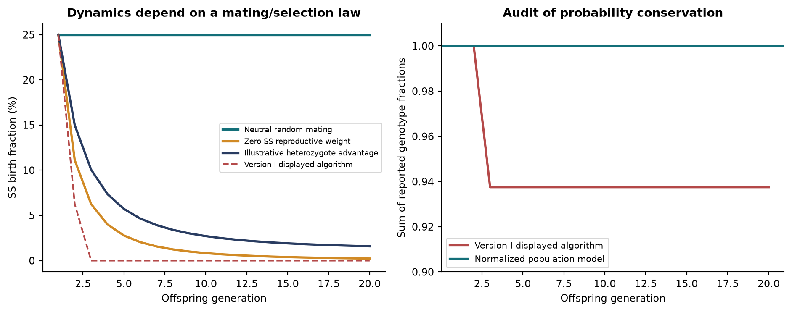
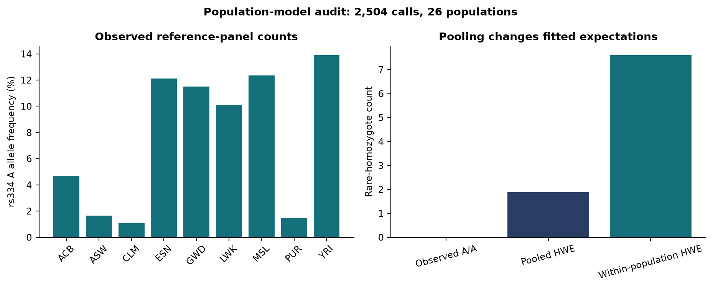
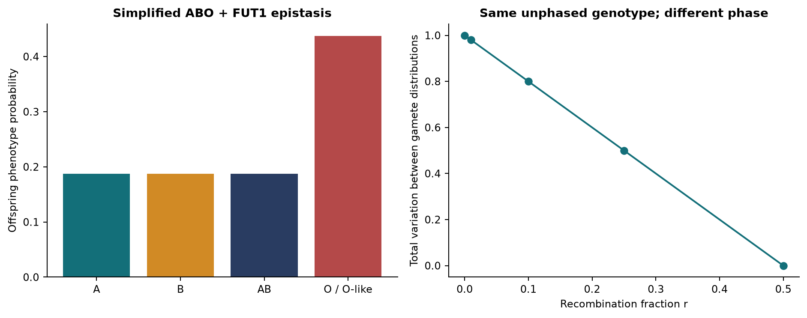
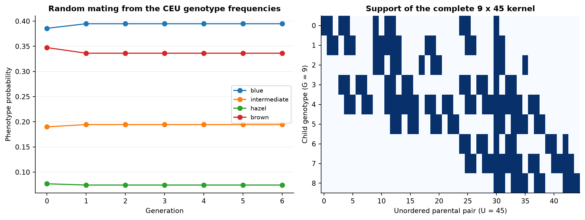
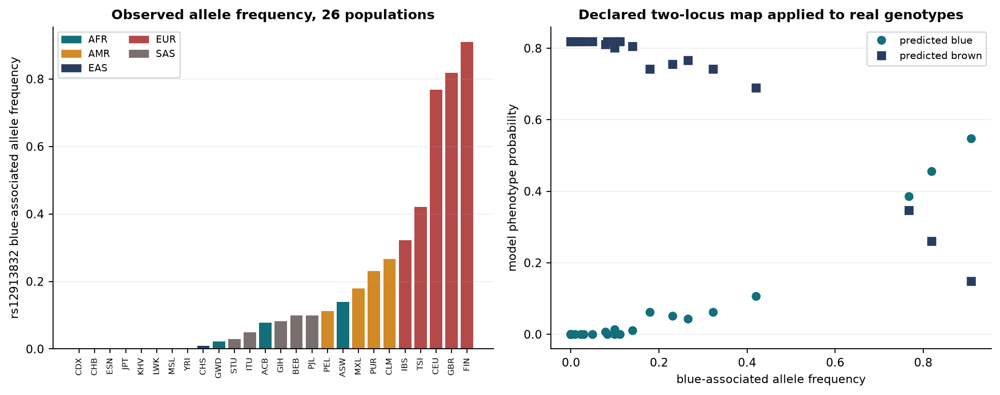
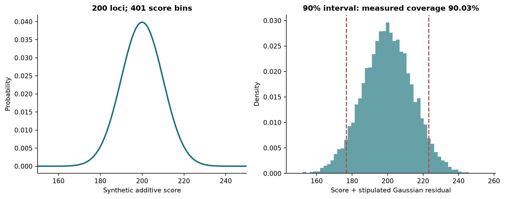

# Inheritance as a Linear Operator, and What Replaces It

## From Punnett squares to a complete probabilistic kernel: an audited, measured and extended treatment of sickle-cell, ABO and ABO x Rh inheritance

Parts I to VII | Arshyia Mehran | Version I written 2022-2025, audited and extended 05 September 2026

Parts I and II preserve the mathematics of the original 54-page study and are reworked only for exposition. Parts III to V are new: they audit that study against its own source code, replace the square-matrix constraint with a complete rectangular kernel, measure four implementations of it, test the population assumptions against public genotype calls, add eye colour as a two-locus trait on real genotype data, and state the general n-locus problem with upper and lower bounds. Part VI derives, without implementing, an extension in which age enters through mutation and epigenetic regulation.

**This is a preprint. It has not been peer reviewed.** Every quantitative claim is reproducible from the accompanying code and retained results; the limits of each claim are stated where it is made, and Section 27 collects the counterarguments that survive.

<!-- pagebreak -->

# Abstract

Version I of this work asked whether linear algebra could replace repeated Punnett-square calculation for sickle-cell anaemia, ABO blood groups and a simplified ABO x Rh system. It answered yes, and identified a limitation: forcing a parental-pair-to-offspring table into a square, diagonalisable matrix appeared to sacrifice population coverage as more alleles were added, falling from 83.62% for ABO to 67.83% for ABO x Rh.

This unified treatment reproduces that work exactly, audits it, and then removes the constraint. An exact-rational reconstruction matches six displayed examples from the original. The audit changes the premise: the original ABO and ABO x Rh MATLAB programs already loop over every parental pair, 36 and 324 ordered pairs respectively. The truncation to a square matrix exists in the prose and displayed tables, not in the executed code. No claim of restored coverage is therefore available, and none is made.

The coverage percentages are reproduced and their provenance separated. Exact propagation of the stated allele frequencies gives 83.4764828157% top-six ABO pair mass; the printed 83.62% follows from coarser inputs summing to 1.001. The joint top-18 mass is 67.8347334921%. The displayed sickle-cell trajectory is reproducible but does not conserve probability: its generation-three output sums to 93.75%, because the algorithm zeroes the affected class without renormalising.

For n independent biallelic diploid loci, an induction proves G = 3^n unphased genotypes and U = G(G+1)/2 unordered parental pairs, generalised to arbitrary allele counts; the complete kernel is G by U with exactly (15^n + 5^n)/2 supported transitions. Dense arrays, compressed sparse rows, hash adjacency and streamed computation are implemented with identical transmission semantics and benchmarked. At five loci, CSR stores 12.59 times less numeric payload than dense storage; the corresponding validated update timings are 12.560 ms (dense) and 9.535 ms (CSR). These are workload- and implementation-specific measurements.

Public rs334 genotype calls from 2,504 individuals across 26 populations support an exact Hardy-Weinberg and pooling audit. A staged extension covers simplified M/N, ABO-FUT1 epistasis, phased two-locus recombination, and a 200-locus additive score whose nominal 90% interval covered 90.03% of 10,000 simulated outcomes. Eye colour is then built as a two-locus epistatic trait on real rs12913832 genotype calls for the same 2,504 individuals, run through the unchanged kernel with four representations agreeing to 2.78e-17, and compared against two published cohorts. The general case is stated as P(n), with output-size lower bounds showing that the complete kernel is Omega(15^n) and that the implemented factored query is Theta(n) and therefore optimal. A final part derives, without implementing, an extension in which parental age enters the transmission kernel through de novo mutation and an individual's age enters the genotype-to-phenotype map through methylation and histone acetylation.

Two findings limit the contribution and are stated rather than buried: a positive mutation rate destroys the structural sparsity the architecture depends on, and age is collinear with its own epigenetic mediators, so the weights of the proposed expression gate are not separately identifiable without a design built to break that collinearity.

Keywords: Mendelian inheritance; transition matrices; combinatorial growth; sparse representation; Hardy-Weinberg equilibrium; model audit; reproducibility; epigenetic regulation.

# Findings

1. **The original programs were already complete.** The ABO and ABO x Rh MATLAB listings evaluate all 36 and all 324 ordered parental pairs through random-mating loops. All 324 of the 324 displayed joint-table entries match each combined genotype crossed with itself. Against the ranked top-18 construction instead, 114 of 324 cells differ. Every displayed column sums to one: true. Restoring coverage to those programs is not an available claim.

2. **The two coverage percentages are reproducible, and their provenance matters.** Exact allele frequencies give 83.4764828157% and 67.8347334921%; the printed 83.62% arises from unnormalised inputs. Both are model-based pair probabilities, not measured shares of any population.

3. **The legacy sickle-cell trajectory does not conserve probability.** Its displayed generation-three output sums to 93.75%. The corrected model separates selection from mating and renormalises the breeding population, giving a reciprocal rather than exponential decline in the S allele.

4. **Sparsity is real but still exponential.** The kernel has exactly (15^n + 5^n)/2 nonzeros against G*U total. Density falls; the nonzero count does not.

5. **Measured representation results.** At five loci CSR retains 4,575,976 payload bytes against dense's 57,631,824, with median validated updates of 9.535 ms and 12.560 ms. All measured implementations agreed within 6.94e-17. One machine, one workload.

6. **External data audits assumptions, not predictions.** rs334 calls for 2,504 individuals across 26 populations give a pooled expectation of 1.874 rare homozygotes against 7.600 from separately fitted populations. No predictive accuracy is established anywhere in this work.

7. **LIMITATION - mutation destroys the sparsity the architecture rests on.** With any positive per-transmission mutation probability, every structural zero of the kernel becomes a positive number. At five loci the supported-transition count rises from 381,250 to the full dense 7,203,978, and CSR becomes strictly worse than dense because it pays index overhead on a matrix with no zeros. The measured 12.59-fold payload advantage is an advantage over a mutation-free model. This argues for the factored representation or a structured low-rank correction; neither is implemented. See Section 24.

8. **LIMITATION - age is collinear with its own mediators.** In the proposed expression gate, methylation fraction is itself a smooth deterministic function of age, so the design matrix carries two nearly collinear columns. The age and methylation weights are then individually unidentifiable while the objective value remains healthy and no diagnostic computed from the fit reveals it. Conditioning must be checked before fitting, and the sampling design must supply within-age variation. See Section 28.

9. **Eye colour transfers, and shows the architecture earning nothing.** A two-locus epistatic model on real rs12913832 calls for 2,504 individuals runs through the unchanged kernel, with four representations agreeing to 2.78e-17. Its density is 0.3086, so compressed storage is not worth its overhead at this size. Under neutral random mating the phenotype distribution is already at its fixed point: nothing decays.

10. **The declared eye-colour model is wrong in a measurable direction.** It implies 25 per cent of HERC2 GG individuals are not blue; a phenotyped cohort of 5,481 reports 33 per cent. Reproducing that figure requires fitting a modifier frequency to it, which is a calibration and not a validation. A published six-SNP model reports AUC 0.96 for blue and brown; this work reports no AUC, because it has no phenotypes.

11. **The exponent is a lower bound, not an implementation defect.** Any algorithm that materialises the complete kernel must write one value per supported transition, so kernel construction is Omega(15^n) for any implementation. Returning all children of a heterozygous pair is Omega(3^n) by output size. The implemented factored single-child query is Theta(n) and therefore asymptotically optimal, and the CSR population update is tight against the same bound.

12. **The derived growth is confirmed at the top of the measured range.** From four to five loci the supported-transition count rises 14.878-fold; measured construction time rose 15.01, 15.09 and 14.68-fold for dense, CSR and hash. A single exponent fitted across all of n = 1..5 returns 8.5 to 10.4 instead, because fixed overhead flattens the small-n slope, and reporting only that would understate the growth by about a third.

13. **Not delivered.** Tries, decision DAGs, priority queues and general factor-graph inference are documented candidates, not implementations. Part VI is derivation only: no code, no test, no dataset. Height is treated derivationally and no height prediction is made.

# Reader's guide

The intellectual progression of Version I is preserved: explain the biology, introduce the mathematics that represents it, implement the model, then evaluate what the output establishes. Each part introduces its concept, derives it, uses it, and then evaluates it against something external.

**Part I** covers the biology, the matrix algebra Version I needs, and the complete sickle-cell derivation, followed by its audit. **Part II** does the same for ABO and then ABO x Rh. **Part III** proves the combinatorial growth by induction, generalises it, and builds and measures the complete kernel that removes the square-matrix constraint. **Part IV** tests the population assumptions against public data and compares the new representation with Version I's square matrices under an explicit taxonomy of what "coverage" can mean. **Part V** adds eye colour as a two-locus epistatic trait driven by real genotype calls, runs it through the same kernel, compares it against published cohorts, then treats height and finally P(n), the general problem of a trait depending on n genes, with upper and lower bounds. **Part VI** derives the age, mutation and epigenetic extension. **Part VII** evaluates the whole.

Numbered Results are stated once and referred to afterwards by number. Every benchmark figure comes from retained machine-readable output; theoretical extrapolations are labelled separately. Sections marked *Audit* revisit Version I with evidence and are the only places where its conclusions are revised. Complexity is treated wherever a model is introduced rather than in one block: a short note for each of sickle cell, ABO and ABO x Rh, the measured comparison in Section 10, and the general upper and lower bounds for n loci in Section 15.

<!-- pagebreak -->

# PART I - FOUNDATIONS AND THE SICKLE-CELL MODEL

# 1. Introduction and research question

A Punnett square answers a one-generation question: given two parental genotypes, what are the offspring probabilities? School biology stops at the second filial generation because the branching becomes unmanageable by hand. To reach generation n one must enumerate every offspring genotype, pair each with every possible mate, and draw a new square for each combination.

Version I's insight was to stop treating a Punnett square as a diagram and start treating it as a **column of a transition matrix**. Write the population as a vector of genotype proportions, and one generation of reproduction becomes a matrix multiplication:

```equation
X(n) = M X(n-1)      so      X(n) = M^n X(0)
```

An exponentially branching process collapses into a matrix power, and everything linear algebra knows about such operators becomes available. Version I attributes this move to a bioinformatics textbook that records a Punnett grid as a matrix and raises it to a power to obtain the genotype ratios of a later generation. [1] [2]

The original research question was whether linear algebra could prove that non-sex-linked traits such as sickle-cell anaemia and blood group have the potential to decay across generations. That question is answered in Parts I and II. It also produced a limitation which Version I stated plainly: as more alleles and genes are added, maintaining a square, diagonalisable matrix forces the model to represent a smaller share of the population.

The present question follows from it:

> **Which representation answers a specified inheritance query completely, correctly and efficiently under a stated biological model?**

Each qualifying word carries weight. Completeness without a declared catalog is undefined. Efficiency without a declared output is misleading. Numerical agreement without external observation establishes nothing about biological accuracy.

# 2. Biological foundations

## 2.1 Alleles, genotype and phenotype

Humans are diploid at autosomal loci: one copy of each gene is inherited from each parent. Two copies of the same allele make a homozygous genotype; two different alleles make a heterozygous one. The pair of alleles carried is the **genotype**; the observable consequence is the **phenotype**. [3]

A dominant allele, conventionally written with a capital letter, masks the effect of a recessive allele. For a disease carried on a recessive allele, only the homozygous recessive individual is affected, while the heterozygote is an unaffected carrier who can still transmit the allele. This asymmetry between what is expressed and what is transmitted is the reason genotype, not phenotype, must be the state variable of the model. [4] Part V returns to it, because expression turns out to depend on more than the allele pair.

## 2.2 Sickle-cell anaemia

Sickle-cell anaemia results from inheriting two copies of the HbS allele. The normal HbA allele carries GAG at the sixth codon of the beta-globin coding sequence; HbS carries GTG. The transcribed messenger codons are therefore GAG and GUG, which translate to glutamic acid and valine respectively. Glutamic acid is hydrophilic; valine is hydrophobic, and the substitution distorts haemoglobin polymerisation and hence red-cell shape, reducing oxygen-carrying capacity and causing vaso-occlusion. [5] [4] Version I illustrates the morphology with a clinical figure and the geographic association with a distribution map; both are third-party images, and this document cites them rather than reproducing them. [6] [7]

The three genotypes of the simplified two-allele model are:

| Genotype | Status | Note |
|---|---|---|
| HbA HbA | Unaffected | No sickle allele |
| HbA HbS | Carrier | Confers a degree of malaria resistance |
| HbS HbS | Affected | Sickle-cell anaemia |

The heterozygote advantage in malarial regions is the standard explanation for the allele's persistence, and it is the assumption that would have to be dropped to model those regions correctly. [8] Version I supported this with an encyclopaedia distribution map [7]; the primary evidence is a geostatistical map of HbS allele frequency built from assembled survey data, which found the areas of high frequency coincident with historical malaria endemicity. [9]

*Scope note, revised in Part I of this unified treatment.* AA/AS/SS is an educational abstraction, not a catalog of HBB disease. Compound heterozygous forms involving other HBB variants also cause disease. Carrier status does not mean half of circulating red cells are permanently sickled. And a universal assumption that affected individuals do not reproduce is not supported; Version I's own conclusion estimated roughly 10% worldwide reproduction among affected individuals, which is small but not zero. Version II therefore treats reproductive weights as declared model parameters and does not forecast eradication dates.

## 2.3 The six parental crosses

With three genotypes per parent and parental order disregarded, there are exactly six parental pairings. Their offspring distributions follow from the Punnett squares:

| Parental cross | HbA HbA | HbA HbS | HbS HbS |
|---|---|---|---|
| HbA HbA x HbA HbA | 1 | 0 | 0 |
| HbA HbA x HbA HbS | 1/2 | 1/2 | 0 |
| HbA HbA x HbS HbS | 0 | 1 | 0 |
| HbA HbS x HbA HbS | 1/4 | 1/2 | 1/4 |
| HbA HbS x HbS HbS | 0 | 1/2 | 1/2 |
| HbS HbS x HbS HbS | 0 | 0 | 1 |

Each row is a valid conditional distribution over offspring and sums to one.

*Complexity.* With one biallelic locus the whole problem is trivially small: G = 3 genotypes, U = 6 unordered parental pairs, and 10 supported transitions out of 18 dense entries, a density of 0.5556. More than half the table is non-zero, so there is nothing for a sparse representation to compress. Section 10.1 records this as the first row of the cost table, and it is the reason Version I's approach was entirely adequate for this trait.

# 3. The matrix algebra Version I requires

This section states the linear algebra used later, at the level at which Version I developed it. [10] Nothing outside it is assumed.

**Identity matrix.** The n by n identity I has ones on the main diagonal and zeros elsewhere, and satisfies A A^-1 = I.

**Determinant.** For a 2x2 matrix with entries a, b, c, d, det = ad - bc. For a 3x3 matrix with first row a, b, c, expansion along that row gives det = a(ei - fh) - b(di - fg) + c(dh - eg), where each minor is the determinant of the entries excluding the row and column of its coefficient, and signs alternate.

**Inverse of a 2x2.** Swap the main-diagonal entries, negate the off-diagonal entries, and divide by the determinant.

**Eigenvalues.** For a square matrix M, the values of lambda satisfying det(M - I lambda) = 0. For a 2x2 this expands to lambda^2 - (a+d) lambda + (ad - bc) = 0, solvable by the quadratic formula. An n by n matrix has n eigenvalues counted with multiplicity, and their product is the determinant.

**Eigenvectors and diagonalisation.** An eigenvector X satisfies M X = lambda X, equivalently (M - I lambda) X = 0 for non-zero X, which requires det(M - I lambda) = 0. Assembling the eigenvectors as the columns of S and the eigenvalues on the diagonal of D gives

```equation
M = S D S^-1     and therefore     M^n = S D^n S^-1
```

Raising a diagonal matrix to a power raises each diagonal entry, which is why diagonalisation makes high powers cheap. This is the computational motivation for the entire Version I approach.

# 4. The sickle-cell transition matrix

## 4.1 Restricting to the reproducing crosses

Version I assumes a non-malarial population, so the heterozygote carries no survival advantage, and assumes that HbS HbS individuals survive but do not reproduce. Under that assumption the three crosses involving an affected parent are removed, leaving three parental columns and three offspring rows:

| Offspring | AA x AA | AA x AS | AS x AS |
|---|---|---|---|
| HbA HbA | 1 | 1/2 | 1/4 |
| HbA HbS | 0 | 1/2 | 1/2 |
| HbS HbS | 0 | 0 | 1/4 |

Let A(n), B(n) and C(n) be the fractions of the nth generation with genotypes AA, AS and SS. Reading the table as coefficients gives the linear system

```equation
A(n) = A(n-1) + (1/2) B(n-1) + (1/4) C(n-1)
B(n) =          (1/2) B(n-1) + (1/2) C(n-1)
C(n) =                         (1/4) C(n-1)
```

which is exactly X(n) = M X(n-1) with M the upper-triangular matrix of the table.

## 4.2 Diagonalisation

Because M is upper triangular, det(M - I lambda) = (1 - lambda)(1/2 - lambda)(1/4 - lambda), giving eigenvalues

```equation
lambda_1 = 1,   lambda_2 = 1/2,   lambda_3 = 1/4
```

Solving (M - I lambda) X = 0 for each, and normalising the free parameter to x = 1, gives eigenvectors (1, 0, 0), (1, -1, 0) and (1, -2, 1). Assembling them as the columns of S, and obtaining S^-1 by elementary row operations on the augmented matrix [S | I], yields M = S D S^-1 and hence

```equation
M^n = S D^n S^-1,     D^n = diag(1, (1/2)^n, (1/4)^n)
```

## 4.3 The limit and its correct reading

Since (1/2)^n and (1/4)^n both tend to zero, D^n tends to diag(1, 0, 0) as n grows. Version I read this as the carrier and affected classes ceasing to exist over generations, leaving only HbA HbA.

The algebra is correct. Its interpretation requires care, and this is the first place where the unified treatment revises Version I.

> **RESULT 4.1 - WHAT THE EIGENVALUE DECAY DOES AND DOES NOT SHOW**
>
> The eigenvalues 1, 1/2 and 1/4 are algebraically correct for the matrix as written. D^n is a representation in the eigenvector basis, not a table of genotype probabilities in the original basis; an nth-generation statement must be transformed back through S.
>
> More importantly, the columns of M are labelled by parental *pairs* and its rows by single offspring *genotypes*. Multiplying by M a second time requires a rule converting a distribution over offspring genotypes into a distribution over parental pairs. Having three entries on each side does not supply that rule. Section 12 constructs it.

## 4.4 Audit: the displayed program does not conserve probability

The MATLAB listing displayed in Version I performs one further operation. After recording each generation it sets the SS component to zero before the next multiplication, without renormalising. The listing is reproduced verbatim in Appendix F, where the operation is the single line `X_next(3) = 0;` immediately after the generation is recorded. Reconstructing that algorithm in exact rational arithmetic from the AS x AS cross reproduces the displayed screenshot exactly, and also exposes what it costs:

| Generation | AA, AS, SS (%) as displayed | Total mass |
| --- | --- | --- |
| 0 | 25.0000, 50.0000, 25.0000 | 1.000000 |
| 1 | 56.2500, 37.5000, 6.2500 | 1.000000 |
| 2 | 75.0000, 18.7500, 0.0000 | 0.937500 |
| 3 | 84.3750, 9.3750, 0.0000 | 0.937500 |
| 4 | 89.0625, 4.6875, 0.0000 | 0.937500 |

The displayed generation-three output, AA 75%, AS 18.75%, SS 0%, is reproduced. Its components sum to 93.75%. Those values can therefore be obtained, but they are not a normalised distribution of genotype proportions; reading them as such overstates the AA share and understates everything else. Treating the deficit as surviving mass would require an explicit population-size interpretation and a justified transition law, neither of which the genotype-pair relabelling supplies.

This is not a coding error so much as a modelling one, and it is the reason Part III separates the transmission kernel from the mating rule.

## 4.5 The repaired generational model

Selection and mating are separated. Selection reweights the current genotype frequencies by fitness and **renormalises the breeding population**; mating then draws two parents independently from that normalised distribution.

Starting from the AS x AS offspring distribution (1/4, 1/2, 1/4) under neutral random mating, the distribution is unchanged: Mendelian segregation alone does not remove an allele. With reproductive weights (1, 1, 0), the S allele frequency q updates as

```equation
q' = q / (1 + q),     hence     q_t = 1 / (t + 2)   starting from q = 1/2
```

> **RESULT 4.2 - THE DECLINE IS RECIPROCAL, NOT EXPONENTIAL**
>
> Under complete reproductive exclusion of affected individuals in an otherwise neutral randomly mating population, the deleterious allele frequency declines as 1/t, not geometrically. At the third offspring generation the SS birth probability is 1/16 under this model, whereas the displayed legacy algorithm has already set it to zero.
>
> The practical consequence: Version I's projection that the disease approximately disappears within four generations and carriers within eight - converted there into calendar years using an average generation interval of about 25 years [11] - does not follow from a correctly normalised model. Recessive alleles persist in carriers, which is precisely why recessive disease is hard to eliminate.



*A note on figures and their licensing.* Version I's decay curves were plotted with an online graphing tool [12]; every figure in this document is instead regenerated from retained machine-readable output, so that no plotted value is independent of the recorded results.

Version I's two biological illustrations are third-party images: a clinical figure of red-cell morphology [6] and an encyclopaedia distribution map [7]. Neither carries a licence permitting redistribution, and this document is published publicly, so neither is reproduced. Both are cited at their point of use, which is the reuse that citation does permit, and the underlying claims are additionally supported by primary literature that can be cited without reproduction [9] [8]. Where a figure was carrying explanatory weight it has been replaced rather than dropped: the geographic argument is now made by the per-population allele frequencies of Sections 11 and 13, which are computed here from the frozen reference-panel snapshots and are therefore free of any reuse restriction.

Version I's screenshots of MATLAB source and program output are superseded by Appendix F, which carries the source verbatim, and by the exact reconstruction of the displayed outputs in Section 6.3.

<!-- pagebreak -->

# PART II - BLOOD GROUPS

# 5. ABO: a three-allele locus

## 5.1 Alleles, weights and genotypes

The ABO locus carries three alleles: I^A, I^B and i. A and B are codominant, and both are dominant to O. [13] [14] Version I introduced a weighting scheme to score genotypes, assigning full expressive weight to the antigen-producing alleles and none to the recessive one:

| Allele | Weight w |
|---|---|
| I^A | 1 |
| I^B | 1 |
| i | 0 |

with a genotype score defined as the mean of its two allele weights, (w1 + w2)/2. This gives 1.0 for AA, BB and AB, 0.5 for AO and BO, and 0.0 for OO.

That scheme is worth pausing on, because it is the earliest form of an idea this document returns to twice. It is a **linear score over allele dosage**: a weight per allele, averaged over the two copies. Part III generalises it to an additive polygenic score over many loci, and Part V generalises it again into a weighted score with a bias term and a nonlinear link, which is what allows expression to depend on age and epigenetic state as well as on genotype. Version I's weight column is the seed of all of it.

Six genotypes follow: AA, AO, BB, BO, AB, OO.

## 5.2 Counting parental pairs

> **RESULT 5.1 - PAIR COUNTS FOR THE ABO CATALOG**
>
> For six genotype labels, the number of unordered pairs with repetition allowed is 6 x 7 / 2 = 21. The number 15 counts only pairs of *distinct* genotypes and omits the six equal-genotype pairings.
>
> An equal-genotype pair means two parents who happen to share a genotype. It does not imply self-fertilisation, and it cannot be discarded.

Version I states 15 on page 30 and then correctly enumerates 21 pairings on pages 32 and 33. The unified treatment keeps 21.

## 5.3 From phenotype frequencies to genotype frequencies

Version I takes worldwide phenotype shares of approximately O 44%, A 42%, B 10%, AB 4% from a secondary summary of global blood-group prevalence [15], and applies the Hardy-Weinberg relations as given in a standard population-genetics text to recover allele frequencies p_A = 0.26, p_B = 0.077, p_O = 0.663, which sum to one. [16] [17] Genotype probabilities follow as

```equation
P(AA) = p_A^2,  P(AO) = 2 p_A p_O,  P(BB) = p_B^2,
P(BO) = 2 p_B p_O,  P(AB) = 2 p_A p_B,  P(OO) = p_O^2
```

Under independent random mating, an unordered parental pair has probability x_i^2 when the genotypes are equal and 2 x_i x_j when they differ.

*Identifiability note.* The phenotype shares are drawn from a secondary aggregator rather than a primary survey, and carry no stated sampling frame or uncertainty; Section 11.4 shows why pooling them across populations is consequential rather than cosmetic. Converting phenotype frequencies into allele frequencies additionally assumes the genotype-phenotype map and population equilibrium. These frequencies are therefore useful as declared inputs for reproduction, but they are not independent validation data for a model derived from them. Predicting them back would reuse the answer.

## 5.4 The six leading crosses, and where 83.62% comes from

Ranking the 21 unordered pairs by probability gives:

| Rank | Parental cross | Model probability (%) |
| --- | --- | --- |
| 1 | AO x OO | 30.309162 |
| 2 | OO x OO | 19.322091 |
| 3 | AO x AO | 11.885946 |
| 4 | BO x OO | 8.976175 |
| 5 | AO x BO | 7.040137 |
| 6 | AA x OO | 5.942973 |

Version I sums the printed percentages to 83.62% and retains these six crosses to form a 6 x 6 square matrix against the six offspring genotypes. The offspring table is:

| Offspring | AO x OO | OO x OO | AO x AO | BO x OO | AO x BO | AA x OO |
|---|---|---|---|---|---|---|
| AA | 0 | 0 | 0.25 | 0 | 0 | 0 |
| AO | 0.50 | 0 | 0.50 | 0 | 0.25 | 1.00 |
| BB | 0 | 0 | 0 | 0 | 0 | 0 |
| BO | 0 | 0 | 0 | 0.50 | 0.25 | 0 |
| AB | 0 | 0 | 0 | 0 | 0.25 | 0 |
| OO | 0.50 | 1.00 | 0.25 | 0.50 | 0.25 | 0 |

## 5.5 Audit: the percentage depends on which inputs are propagated

Recomputing the retained mass under each candidate set of inputs separates arithmetic from provenance:

| Calculation | Top-six ABO pair mass (%) | Top-18 joint pair mass (%) | Input genotype mass |
| --- | --- | --- | --- |
| Stated allele frequencies, propagated exactly | 83.4764828157 | 67.8347334921 | 1.000000 |
| Four-decimal genotype table on page 32 | 83.4891760000 | 67.8455062501 | 1.000000 |
| Coarser inputs used in the pair formulas | 83.6205000000 | 67.9390313612 | 1.001000 |
| Same coarse inputs, normalised first | 83.4535095274 | 67.8033568442 | 1.000000 |
| Printed percentages added as displayed | 83.62 | 67.83 | not applicable |

The coarse genotype inputs used in the pair formulas sum to 1.001, so the total parental-pair mass is 1.001^2 = 1.002001 and the resulting 83.62% is not a rigorously normalised probability. Propagating the stated allele frequencies exactly gives 83.4764828157%. The discrepancy is small; the point is that a quoted percentage needs its normalisation stated alongside it.

These are model-based pair probabilities under chosen allele frequencies. They are not directly measured shares of the world's population.

# 6. ABO x Rh: two loci at once

## 6.1 The Rh locus

The RHD gene encodes the D antigen. In the simplified model used here, D is dominant and d recessive, giving genotypes DD, Dd and dd and phenotypes positive, positive and negative. Two Rh-positive parents who are both Dd have a one-quarter chance of a dd child. [18] [19]

*Scope note.* The full Rh system involves RHD and RHCE variation and many variants not captured by a single dominant/recessive pair. The one-quarter statement is valid for Dd x Dd, not for every pair of positive parents.

Version I takes Rh-negative phenotype frequency 0.07, from a secondary chart of regional blood-type prevalence. [20]

> **RESULT 6.1 - THE ALLELE FREQUENCY IS THE SQUARE ROOT**
>
> Under the simplified Hardy-Weinberg model, a recessive phenotype frequency of 0.07 implies a d allele frequency of sqrt(0.07) = 0.2645751311, not 0.07. Using the phenotype frequency directly as the allele frequency would misstate every genotype probability that follows.

## 6.2 Combined catalog and pair counts

Six ABO states combine with three Rh states to give 18 combined genotypes, and therefore:

| Counted object | Simplified ABO | Simplified ABO x Rh |
| --- | --- | --- |
| Genotypes in the catalog | 6 | 18 |
| Ordered parental pairs | 36 | 324 |
| Unordered parental pairs | 21 | 171 |
| Distinct-genotype pairs only | 15 | 153 |
| Square matrix Version I retained | 6 | 18 |

*Complexity.* ABO alone has G = 6, U = 21 and 45 supported transitions out of 126 dense entries, a density of 0.3571. Adding Rh gives G = 18, U = 171 and 615 supported transitions out of 3,078, a density of 0.1998. The density has almost halved for one added locus, which is Result 7.4 becoming visible at the smallest scale the paper examines: this is the point at which compressed storage begins to be worth considering, and the point at which manual tabulation stops being reasonable.

Multiplying the exact ABO and Rh genotype frequencies and ranking the unordered joint pairs gives:

| Rank | Parental cross | Model probability (%) |
| --- | --- | --- |
| 1 | AO/DD x OO/DD | 8.865989 |
| 2 | OO/DD x OO/Dd | 8.133511 |
| 3 | AO/DD x OO/Dd | 6.379224 |
| 4 | AO/Dd x OO/DD | 6.379224 |
| 5 | OO/DD x OO/DD | 5.652068 |
| 6 | AO/DD x AO/Dd | 5.003313 |
| 7 | AO/Dd x OO/Dd | 4.589957 |
| 8 | AO/DD x AO/DD | 3.476858 |
| 9 | OO/Dd x OO/Dd | 2.926097 |
| 10 | BO/DD x OO/DD | 2.625697 |
| 11 | AO/DD x BO/DD | 2.059370 |
| 12 | BO/Dd x OO/DD | 1.889232 |
| 13 | BO/DD x OO/Dd | 1.889232 |
| 14 | AO/Dd x AO/Dd | 1.799983 |
| 15 | AA/DD x OO/DD | 1.738429 |
| 16 | AO/DD x BO/Dd | 1.481750 |
| 17 | AO/Dd x BO/DD | 1.481750 |
| 18 | OO/DD x OO/dd | 1.463049 |

The top-18 mass is 67.8347334921%, which rounds to the reported 67.83%. Independently rounded row percentages sum to 67.84%; rounding rows and rounding their unrounded total need not agree.

## 6.3 Audit: what the displayed 18 x 18 table actually is

This is the most consequential audit finding in the document.

All 324 of the 324 displayed joint-table entries match each combined genotype crossed with itself. Against the ranked top-18 construction instead, 114 of 324 cells differ. Every displayed column sums to one: true.

In other words, the displayed 18 x 18 table is **each combined genotype crossed with itself**, not the ranked top-18-parental-pair table it is described as. Meanwhile the MATLAB code on the following pages loops over all 324 ordered parental pairs, combining independent ABO and Rh transmissions, and is therefore a complete random-mating calculation for its declared model.

The same holds one locus down: the ABO code loops over all 36 ordered pairs, so iterating the displayed six-column table instead would give a different result.

> **RESULT 6.2 - THE LEGITIMATE COMPARISON IS NARROWER THAN IT LOOKS**
>
> Version I's executed programs already include every pairing within their declared catalogs. A successor can therefore show that the prose's truncation is unnecessary, and can measure storage and inference alternatives to the complete algorithm.
>
> It cannot claim that the implemented ABO and ABO x Rh programs had 83.62% and 67.83% support and that a new sparse implementation raised them to 100%. That comparison would misrepresent the baseline.

Six displayed examples were reconstructed in exact rational arithmetic to confirm the reconstruction before the audit was trusted:

| Original page | Displayed input and generation | Reconstruction |
| --- | --- | --- |
| 28 | AS x AS, generation 3 | AA 75%, AS 18.75%, SS 0%; total93.75% |
| 35 | AA x OO, generation 3 | AA25%, AO50%, OO25% |
| 36 | AO x BO, generation 4 | AA6.25%, AO25%, BB6.25%, BO25%, AB12.5%, OO25% |
| 49 | AO/Dd x AO/Dd, generation 3 | A+56.25%, A-18.75%, O+18.75%, O-6.25% |
| 50 | AA/dd x BO/Dd, generation 7 | All18 displayed genotype percentages match after rounding |
| 50 | AB/dd x OO/Dd, generation 8 | All18 displayed genotype percentages match after rounding |

<!-- pagebreak -->

# PART III - THE COMBINATORIAL THEOREM AND THE COMPLETE KERNEL

# 7. How large is the state space?

Version I's limitation was empirical: the matrices got unmanageable. This section makes the growth exact, because a limitation that is proved can be reasoned about, while one that is merely observed cannot.

## 7.1 Genotypes: a proof by induction

> **RESULT 7.1 - GENOTYPE COUNT FOR n BIALLELIC LOCI**
>
> For n independent biallelic diploid loci, the number of distinct unphased multilocus genotypes is G(n) = 3^n.
>
> *Proof by induction on n.*
>
> *Base case.* For n = 1 the catalog is AA, Aa, aa, so G(1) = 3 = 3^1. For completeness, n = 0 admits exactly one empty tuple, and 3^0 = 1.
>
> *Inductive hypothesis.* Suppose G(k) = 3^k for some k >= 1.
>
> *Inductive step.* Every k-locus genotype tuple can be extended at a new independent locus in exactly three ways, by appending AA, Aa or aa. Distinct extensions of distinct tuples are distinct, and every (k+1)-locus tuple arises from exactly one k-locus prefix with exactly one appended state. The extension map is therefore a bijection onto a set three times the size, so G(k+1) = 3 G(k) = 3 * 3^k = 3^(k+1).
>
> By induction G(n) = 3^n for every non-negative integer n. QED

## 7.2 Generalisation to arbitrary allele counts

> **RESULT 7.2 - GENOTYPE COUNT FOR ARBITRARY ALLELE COUNTS**
>
> At a locus with a alleles there are a homozygous genotypes and a(a-1)/2 heterozygous ones, totalling a(a+1)/2. Across n independent loci with allele counts a_1 ... a_n,
>
> ```equation
> G = product over l of [ a_l (a_l + 1) / 2 ]
> ```
>
> The same induction applies: adding a locus multiplies the catalog by that locus's genotype count.
>
> *Check against Part II.* ABO has a = 3, giving 3*4/2 = 6 genotypes. Rh has a = 2, giving 3. Combined, 6 x 3 = 18, which is exactly the catalog Version I used.

## 7.3 Parental pairs

> **RESULT 7.3 - UNORDERED PARENTAL PAIR COUNT**
>
> Choosing two genotypes from G with repetition allowed and order disregarded gives
>
> ```equation
> U = G + G(G-1)/2 = G(G+1)/2
> ```
>
> For ABO, U = 6*7/2 = 21, confirming Result 5.1. For ABO x Rh, U = 18*19/2 = 171. For n biallelic loci, U = 3^n (3^n + 1)/2, which is asymptotically 9^n/2: **each additional biallelic locus multiplies the parental-pair space by about nine.**

This is the growth Version I ran into. It is not an artefact of MATLAB, of matrices, or of implementation quality.

| Biallelic loci n | Genotype states G | Unordered pairs U | Supported transitions |
| --- | --- | --- | --- |
| 1 | 3 | 6 | 10 |
| 2 | 9 | 45 | 125 |
| 3 | 27 | 378 | 1,750 |
| 4 | 81 | 3,321 | 25,625 |
| 5 | 243 | 29,646 | 381,250 |
| 6 | 729 | 266,085 | 5,703,125 |
| 10 | 59,049 | 1,743,421,725 | 288,330,078,125 |

## 7.4 Supported transitions: sparse, and still exponential

Not every (parental pair, child) combination is possible. Counting the possible ones bounds what a sparse representation must store.

> **RESULT 7.4 - SUPPORTED-TRANSITION COUNT**
>
> For one biallelic locus, the numbers of possible children across the nine ordered parental pairs form the rows (1,2,1), (2,3,2), (1,2,1), totalling 15. Support products distribute over sums across independent loci, so the ordered kernel has 15^n nonzero entries.
>
> To remove parent-order duplication, pair each supported transition with its parent-swapped counterpart. A transition is fixed under the swap exactly when the two parental genotypes are identical; the single-locus equal-genotype support counts are 1, 3, 1, totalling 5, hence 5^n across loci. Therefore
>
> ```equation
> N_nonzero = (15^n + 5^n) / 2
> N_dense   = G U = (27^n + 9^n) / 2
> density   = (15^n + 5^n) / (27^n + 9^n)
> ```

> **RESULT 7.5 - ARBITRARY ALLELE COUNTS**
>
> Let H = a(a-1)/2 be the heterozygote count at a locus. Across all one-locus parental genotypes the sum of distinct transmissible allele counts is a + 2H = a^2, so ordered pairs contribute a^4, except that two identical heterozygous parents generate one duplicated unordered heterozygous child; subtracting those H duplicates gives T(a) = a^4 - H. Equal-genotype parent pairs contribute D(a) = a + 3H. The unordered support total across independent loci is one half of the product of T(a_l) plus the product of D(a_l).
>
> *Verified by exhaustive allele-copy enumeration:* 45 nonzeros for the ABO catalog and 615 for ABO x Rh.

## 7.5 Hypotheses that follow, and what would refute them

The counting results license three conjectures about representation. They are stated as hypotheses because only the first is settled here.

**H1 - Sparse storage helps, and its help is bounded.** Density falls like (15/27)^n, so compressed storage should win increasingly on payload as n grows, while the absolute nonzero count still grows like 15^n/2. Prediction: a measurable payload advantage at small n that never becomes an asymptotic rescue. *Tested in Section 10; supported.*

**H2 - Crossover is workload-dependent, not universal.** Dense contiguous arithmetic should beat sparse indexing at small n, where overhead dominates. Prediction: dense is competitive or better at n = 1 or 2. *Tested in Section 10; supported.*

**H3 - Only factorisation escapes the exponent.** Any representation that materialises the joint kernel inherits 15^n/2; only methods that keep per-locus factors separate and answer a smaller question avoid it. Prediction: a factored single-child query should scale polynomially in n while full enumeration cannot. *Tested in Section 10 to n = 1000; supported for that query class only.*

A fourth hypothesis is raised in Part V and is **not** supported: that the sparsity of H1 survives biological realism. It does not, once mutation is admitted.

# 8. The complete kernel

## 8.1 Transmission separated from mating

For a diploid genotype g = (u, v), define the gamete probability t_g(a) as one half the number of copies of allele a in g. For an unordered child genotype o = (a, b) the local transmission rule is t_g(a) t_h(a) when a = b, and t_g(a) t_h(b) + t_g(b) t_h(a) otherwise, the second expression summing the two parental routes to the same heterozygote. [21] Under independent segregation the multilocus conditional probability is the product of local ones.

```equation
K[o, pair(i,j)] = P(child = o | parent1 = i, parent2 = j)
shape(K) = G x U ;    sum over o of K[o, c] = 1
```

> **RESULT 8.1 - THE KERNEL NEED NOT BE SQUARE**
>
> K is a rectangular linear map from a distribution over parental pairs to a distribution over children. It requires neither an inverse nor a diagonalisation to perform that map.
>
> The square-matrix constraint of Version I was therefore never a mathematical necessity. It was a consequence of wanting to raise the operator to a power, which requires a map from a space to itself.

## 8.2 Why random mating is nonlinear

If two parents are drawn independently from the same genotype distribution x, set w_ii = x_i^2 and w_ij = 2 x_i x_j for i < j. The next generation is K w(x), and normalisation follows since the sum of w is (sum x)^2 = 1. But the map from x to the next x is quadratic.

> **RESULT 8.2 - NO FIXED LINEAR MAP REPRESENTS RANDOM MATING**
>
> A population of only AA remains AA; a population of only aa remains aa. Mixing the two equally and allowing random mating gives AA 1/4, Aa 1/2, aa 1/4, whereas averaging the two unmixed outcomes gives no heterozygotes at all.
>
> Hence F((x+y)/2) is not (F(x)+F(y))/2, and no fixed matrix power can represent the closed random-mating process.

## 8.3 When a square matrix is legitimate

A square operator is correct for a lineage whose mates are drawn from a *fixed external* distribution q. Define M_q[o, i] = sum over j of K[o, pair(i,j)] q_j. This maps individual genotypes to individual genotypes, preserves normalisation, and may legitimately be raised to a power while q is held fixed.

This rehabilitates part of Version I. Its sickle-cell matrix is a valid fixed-mate operator under a stated mating assumption; what it is not is a closed random-mating population model. The issue was never that square matrices are forbidden, but that the meaning of the state must match the operator applied to it.

# 9. Implementation

## 9.1 One semantic kernel, four physical representations

The engine encodes canonical unordered allele pairs per locus into a mixed-radix integer, validating dimensions and index bounds. Parent-exchange symmetry halves redundant work without deleting equal-genotype pairs. Local Punnett outcomes aggregate repeated allele-copy paths and are cached in a bounded least-recently-used table.

- **Dense** allocates all G x U binary64 entries: 8GU bytes of payload.
- **CSR** stores only positive transmissions with child-row indices and row pointers, built through compressed columns and converted for repeated updates. [17]
- **Hash adjacency** maps a parental pair to a map of its possible children; its footprint is dominated by Python object overhead and is reported under a different metric.
- **Streamed** generates local factor products on demand and accumulates a child distribution without storing the kernel.

All four use the same catalog order and transmission rule, which is what makes the comparison meaningful.

## 9.2 Factored queries

For fully specified parents and a fully specified child, the log probability is the sum of per-locus log probabilities: O(n) arithmetic and O(n) local storage, with no enumeration. This is probability factorisation, not a general pedigree solver; tree-structured factor graphs admit exact messages while arbitrary loops do not, and general variable elimination can require factors exponential in induced width. [22] [23]

If the parental population itself factorises across loci, so does the offspring population. But independent segregation does not imply that an arbitrary population factorises: a population concentrated on AA/BB and aa/bb carries a correlation its marginals cannot retain, and a regression test checks that substituting marginals changes the result.

## 9.3 Resource limits and the numerical contract

Before materialising anything, the implementation computes catalog size, pair count, nonzero count and representation estimates, and a byte budget may refuse the request, returning a structured resource error while leaving factored queries available. A caught allocation failure clears the bounded cache and propagates a structured error rather than an incomplete object.

The scientific contract is explicit. **No probability threshold removes rare transmission branches.** Structural zeros are omitted in sparse representations; positive values are never pruned. Conditional queries expose a log-space interface, and the ordinary probability interface raises rather than returning a silent zero when a mathematically positive result underflows. Population updates use binary64 and explicitly reject detected zero underflows; this is not a general log-space population engine, and Section 24 shows why that gap becomes pressing.

## 9.4 Verification before measurement

The primary oracle enumerates maternal and paternal allele-copy choices independently of the kernel builder, converts each path to a canonical child, and sums exact rational weights. Exhaustive tests cover one-locus biallelic and triallelic systems, four-allele loci, two- and three-locus biallelic systems and ABO x Rh, checking parent-exchange symmetry, normalisation, supported-transition counts and exact Mendelian probabilities. Dense and CSR are compared entry for entry; hash and streamed results are compared against dense for seeded non-uniform inputs. Allocation failure is injected deterministically rather than by exhausting the machine.

Legacy regression tests deliberately preserve the original sickle-cell defect, expecting the displayed result to sum to 17/16 while the repaired model sums to one. A test that silently fixed the legacy output would erase the evidence the audit rests on.

Adversarial review found and fixed four numerical defects during development: underflow in a lazy probability product, an absolute tolerance that distorted extreme exact-HWE tails, underflow when multiplying very small positive fitness weights, and a dense convolution where three shifted additions suffice. An independent exact-integer HWE enumeration checked every genotype triple with total sample size 1 to 30, 5,455 triples, with maximum absolute discrepancy below 7e-15.

The final automated verification recorded 32 passing tests, zero failures, and zero errors. The retained JUnit XML and test log identify the executed suite. All 20 representation-by-dimension benchmark comparisons pass an absolute agreement threshold of 10^-12, with the measured maximum difference reported below.

# 10. Measurement

The retained run uses three construction repetitions and seven inference repetitions per materialized representation and dimension. Each construction sample and each inference or memory configuration runs in a fresh worker. Imports and model setup are outside timed construction. One untimed construction warms allocator/library behavior, followed by clearing the local-cross cache before each timed construction. Inference uses an untimed warm-up and warm local tables. The traced-memory pass begins after scientific-library imports and covers construction plus one update. The complete recorded environment is in benchmark.json; the summary below reproduces its key fields.

| Environment item | Recorded value |
| --- | --- |
| python | 3.12.14 (main, Aug 25 2026, 14:01:42) [MSC v.1944 64 bit (AMD64)] |
| platform | Windows-11-10.0.26200-SP0 |
| processor | Intel64 Family 6 Model 151 Stepping 2, GenuineIntel |
| logical_cpu_count | 24 |
| numpy | 2.5.2 |
| scipy | 1.18.1 |

| Loci | Method | Retained bytes* | Build median (ms) | Update median (ms) |
| --- | --- | --- | --- | --- |
| 1 | dense | 144 | 0.092 | 0.032 |
| 1 | csr | 136 | 0.179 | 0.037 |
| 1 | hash | 2,356 | 0.077 | 0.022 |
| 1 | streamed kernel | 0 | No full kernel | 0.039 |
| 2 | dense | 3,240 | 0.323 | 0.045 |
| 2 | csr | 1,540 | 0.507 | 0.050 |
| 2 | hash | 18,756 | 0.333 | 0.067 |
| 2 | streamed kernel | 0 | No full kernel | 0.313 |
| 3 | dense | 81,648 | 3.501 | 0.155 |
| 3 | csr | 21,112 | 3.671 | 0.176 |
| 3 | hash | 191,684 | 3.551 | 0.651 |
| 3 | streamed kernel | 0 | No full kernel | 4.012 |
| 4 | dense | 2,152,008 | 49.604 | 1.129 |
| 4 | csr | 307,828 | 51.231 | 1.026 |
| 4 | hash | 2,260,956 | 50.376 | 8.837 |
| 4 | streamed kernel | 0 | No full kernel | 58.544 |
| 5 | dense | 57,631,824 | 744.577 | 12.560 |
| 5 | csr | 4,575,976 | 772.977 | 9.535 |
| 5 | hash | 29,427,332 | 739.609 | 119.853 |
| 5 | streamed kernel | 0 | No full kernel | 831.938 |

*Dense/CSR: retained numeric buffers only. Hash: recursive Python-object footprint, a different metric. Streamed: no retained full-kernel buffer; this is not zero process memory. The figure uses the separate traced-allocation pass for all methods.

At five loci, the full catalog contains G=243 genotypes and U=29,646 unordered pairs. The kernel has 381,250 nonzeros. Dense numeric payload is 57,631,824 bytes; CSR payload is 4,575,976 bytes, a 12.59-fold reduction. The ratio of dense to CSR median validated-update time is 1.32. Construction medians are 0.7446 s and 0.7730 s respectively. The maximum absolute discrepancy from the dense result over every measured method and dimension is 6.94e-17. The complete timing samples, minima, maxima, standard deviations, and separate memory records are retained rather than hidden behind these medians.


Factored single-child queries, a different and smaller output, scale as predicted by H3:

| Loci | Median query (microseconds) | Traced peak (bytes) | Absolute log error |
| --- | --- | --- | --- |
| 10 | 11.803 | 12,425 | 0 |
| 50 | 49.378 | 24,609 | 7.11e-14 |
| 100 | 105.590 | 38,801 | 1.14e-13 |
| 1000 | 1246.460 | 266,069 | 2.61e-11 |

At six loci the dense kernel alone would require 1,551,807,720 payload bytes, and the configured 256 MiB budget refuses that materialisation. Sizes outside the bounded experiment are labelled resource-refused or not measured; they are never presented as completed timings.

These results compare implementations written for this project, mixing Python iteration with compiled NumPy and SciPy operations. They do not isolate data-structure choice from every implementation effect, and they report no MATLAB-to-Python speedup, because MATLAB was never executed.

## 10.1 Cost model and the complexity of each model in this paper

A measured time is a fact about one machine. An asymptotic bound is a fact about the problem, and it is the part that transfers. The cost model counts arithmetic operations on probability values and array entries written, treating one binary64 multiply-add as unit cost and ignoring cache behaviour, which the measured timings in Section 10 capture instead.

Under that model the derived quantities of Section 7 are directly the cost of the corresponding operation. Kernel construction writes one value per supported transition, so it is Theta of the nonzero count. A dense population update touches every entry including the structural zeros, so it is Theta(G U). A CSR update touches only the nonzeros. For the models this paper actually builds:

| Model | Allele counts | G | U | Supported transitions | Dense entries | Density |
| --- | --- | --- | --- | --- | --- | --- |
| Sickle cell (HBB, simplified) | 2 | 3 | 6 | 10 | 18 | 0.5556 |
| ABO | 3 | 6 | 21 | 45 | 126 | 0.3571 |
| ABO x Rh | 3 x 2 | 18 | 171 | 615 | 3,078 | 0.1998 |
| Eye colour (HERC2 + modifier) | 2 x 2 | 9 | 45 | 125 | 405 | 0.3086 |
| Three biallelic loci | 2 x 2 x 2 | 27 | 378 | 1,750 | 10,206 | 0.1715 |
| Five biallelic loci | 2 x 2 x 2 x 2 x 2 | 243 | 29,646 | 381,250 | 7,203,978 | 0.0529 |

The density column is the quantity that decides whether compressed storage is worth its indexing overhead, and it falls as (15/27)^n by Result 7.4. At one locus it is above one half and sparse storage is pointless; at five loci it is 0.0529 and sparse storage saves an order of magnitude. Section 15.3 gives the matching lower bounds, which is what turns these upper bounds into statements about the problem rather than about this implementation.

## 10.2 Derived growth against measured growth

An asymptotic claim earns its place only if the machine can be seen approaching it. Fitting T = a b^n to the measured construction medians and comparing b against the derived per-locus work ratio gives:

| Representation | Fitted over n = 1..5 | Measured n = 4 to 5 | Derived work ratio |
| --- | --- | --- | --- |
| dense | 10.00 | 15.01 | 14.878 |
| csr | 8.46 | 15.09 | 14.878 |
| hash | 10.35 | 14.68 | 14.878 |
| streamed kernel | no full kernel | no full kernel | 14.878 |

Construction is dominated by enumerating supported transitions, so the work ratio from four to five loci is nnz(5)/nnz(4) = 14.878. Measured construction time over that same step rose by 15.01 (dense), 15.09 (CSR) and 14.68 (hash), agreeing with the derived ratio to about 1.5 per cent. A least-squares exponent fitted over all of n = 1..5 instead gives 8.5 to 10.4, because fixed per-call overhead dominates the smallest problems and flattens the fitted slope. The asymptotic claim is therefore supported by the top of the measured range and not by the whole of it, which is what an asymptotic claim is entitled to.


> **RESULT 10.1 - THE DERIVED EXPONENT IS CONFIRMED AT THE TOP OF THE MEASURED RANGE, NOT ACROSS IT**
>
> From four loci to five, the supported-transition count rises by a factor of 14.878. Measured construction time over the same step rose by 15.01 for dense, 15.09 for CSR and 14.68 for hash: agreement with the derived ratio to about 1.5 per cent.
>
> A single exponent fitted across all of n = 1 to 5 instead returns 8.5 to 10.4, because fixed per-call overhead dominates the smallest problems and flattens the fitted slope.
>
> Both numbers are correct and they answer different questions. The asymptotic claim is entitled to the top of the range and not to the whole of it, and reporting only the fitted exponent would have understated the growth by roughly a third.

## 10.3 Structures considered and not built

A trie can share prefixes and answer partial-genotype queries, but a complete n-locus ternary trie still has (3^(n+1) - 1)/2 nodes; dynamic allocation reduces unused pointers without reducing catalog size. [24] [25] A hash map gives expected constant probes for fixed-size keys while hashing a long multilocus key still costs length-dependent work. [26] Reduced decision graphs merge equal suffix computations, but their size depends on the function and the variable order. [27] A priority queue can visit likely outcomes first, but ordering an incomplete output does not make it a distribution. [28]

None of these was built. Building one to demonstrate a predetermined winner would have been the wrong experiment; each solves a different subproblem, and a later benchmark must supply the prefix, reuse or ranked-output workload that justifies the extra machinery.

<!-- pagebreak -->

# PART IV - EVIDENCE AND COMPARISON

# 11. Testing the population assumptions against real data

## 11.1 What Hardy-Weinberg is

At one locus with allele probabilities p and q = 1 - p, independent gametes give genotype probabilities p^2, 2pq, q^2, and under the idealised large-population neutral random-mating model these persist across generations. [17] Selection, migration, non-random mating, drift, sampling and genotyping behaviour can all make an observed sample differ. The algebra alone does not license reading a pooled global phenotype percentage as a universal genotype distribution, which is exactly what Part II's ABO inputs did.

## 11.2 Data and provenance

The empirical test uses the public Ensembl rs334 population-genotype endpoint, filtered to the 26 non-overlapping component populations of the 1000 Genomes phase-3 reference panel: 2,504 individuals, with genomic T/T = 2,367, T/A = 137, A/A = 0. These are observed genotype calls, not frequencies inferred under Hardy-Weinberg. Entries absent from the API are zero-completed only after genotype totals, allele counts and reported frequencies agree, and the snapshot is retained with a hash and fetching instructions. [29] [30]

Superpopulation and ALL records overlap component populations and are used only as separate pooled diagnostics. The variant is on the GRCh38 forward strand; HBB's transcript notation has the complementary orientation. The dataset is not a worldwide probability sample, a newborn disease survey, or a family transmission cohort, and its population labels are source metadata, not a basis for inferring any individual's ancestry or clinical outcome. [31]

## 11.3 The exact test

Given counts (nTT, nTA, nAA), estimate q = (2 nAA + nTA)/(2N) and compute N times the Hardy-Weinberg probabilities. These fitted expectations are a compatibility check, not out-of-sample predictions. The exact test conditions on N and the observed count of one allele; feasible heterozygote counts share the parity of the allele count and determine both homozygote counts, and the conditional probability of a table is proportional to N! 2^h divided by nTT! h! nAA!. The two-sided probability-ordering p-value sums feasible tables no more probable than the observed one, computed through log-factorials to avoid an absolute tolerance swamping a small tail. [32] The 26 component tests receive a Holm adjustment. [33]

| Population / diagnostic | N | Observed T/T, T/A, A/A | Exact HWE p |
| --- | --- | --- | --- |
| ACB | 96 | 87, 9, 0 | 1.000000 |
| ASW | 61 | 59, 2, 0 | 1.000000 |
| CLM | 94 | 92, 2, 0 | 1.000000 |
| ESN | 99 | 75, 24, 0 | 0.349703 |
| GWD | 113 | 87, 26, 0 | 0.354696 |
| LWK | 99 | 79, 20, 0 | 0.591267 |
| MSL | 85 | 64, 21, 0 | 0.349575 |
| PUR | 104 | 101, 3, 0 | 1.000000 |
| YRI | 108 | 78, 30, 0 | 0.213792 |
| AFR (pooled) | 661 | 529, 132, 0 | 0.001590 |
| ALL (pooled) | 2504 | 2367, 137, 0 | 0.260974 |

The 17 monomorphic component populations remain in the CSV and the 26-test adjustment. They are omitted here only to keep the displayed diagnostic table compact.



## 11.4 Reading

The YRI subset has (78, 30, 0) at N = 108, estimated rare-allele frequency 0.138889, expectations approximately (80.083, 25.833, 2.083) and exact p = 0.213792. The pooled AFR diagnostic has (529, 132, 0), expects (535.590, 118.820, 6.590) and gives p = 0.001590. None of the 26 component tests has a Holm-adjusted p below 0.05.

> **RESULT 11.1 - POOLING CHANGES THE PREDICTION BEFORE ANY BIOLOGY IS INVOKED**
>
> Summing fitted rare-homozygote expectations across component populations gives 7.600, against 1.874 from a single globally pooled allele estimate. The difference follows from the variation of q between groups, since the weighted mean of q^2 is at least the square of the weighted mean.
>
> Consequence for Part II: Version I's use of pooled worldwide phenotype shares as though they described one Hardy-Weinberg population is not a harmless simplification. Pooling changes what the model predicts.

No component population records a single A/A call. That is a fact about this ascertained reference panel, not evidence about disease prevalence, and it does not establish selection. External inheritance prediction would require independent parent-offspring observations with a defined sampling protocol.

# 12. Weights, coverage, and comparison with the square-matrix baseline

## 12.1 Four different things called accuracy

Version I's conclusion moves between structural coverage and predictive accuracy. Separating them is necessary before any comparison can be honest.

| Metric | Definition | What it does not establish |
|---|---|---|
| Genotype catalog coverage | represented labels / G | Population prevalence |
| Parent-pair coverage | represented pairs / U | Equal event probabilities |
| Supported-transition coverage | retained nonzeros / complete nonzeros | Clinical prediction |
| Retained probability mass | sum of retained event probabilities under declared inputs | A world-population estimate |
| Computational agreement | difference from an independent implementation or exact oracle | External biological accuracy |
| Predictive performance | held-out observed outcomes against predicted distributions | Portability to other populations |

The top-six ABO table covers 6/21 = 28.57% of pair *labels* while retaining about 83.4764828157% of probability *mass*. Both numbers are meaningful; they answer different questions, and neither is accuracy.

## 12.2 The comparison

| Aspect | Version I square matrix | Complete kernel (this work) |
|---|---|---|
| ABO object | 6 x 6, six retained crosses | 6 x 21 rectangular kernel |
| ABO x Rh object | 18 x 18, described as top-18 crosses | 18 x 171 rectangular kernel |
| What the 18 x 18 table actually contains | each genotype crossed with itself; 114 of 324 cells differ from the ranked construction | not applicable |
| Executed MATLAB behaviour | all 36 and all 324 ordered pairs already enumerated | same semantics, four representations |
| Parent-pair coverage | 28.57% (ABO), 10.53% (ABO x Rh) of labels in the displayed tables | 100% within the declared catalog |
| Retained probability mass | 83.4764828157% / 67.8347334921% for the displayed tables | 100% within the declared catalog |
| Requires diagonalisability | yes, and hence squareness | no |
| Rare outcomes | discarded to preserve squareness | retained; no threshold prunes positive branches |
| Predictive accuracy | not established | not established |

The last row is the important one. The new representation is complete where the displayed tables were truncated, and it is measured rather than asserted. It is not more *accurate*, because neither version has been tested against held-out inheritance outcomes.

> **RESULT 12.1 - WHAT THE REPLACEMENT ACTUALLY BUYS**
>
> Removing the square-matrix constraint converts a representational compromise into a declared modelling choice. Version I discarded rare parental pairs because the algebra it wanted required a square operator; the complete kernel keeps them because a rectangular map needs no inverse.
>
> This is a genuine gain in completeness and an honest one in scope. It is not a gain in predictive power, and the audit of Section 6.3 means it is not even a gain over what the original code executed.

## 12.3 Staged biological extensions

Before attempting anything polygenic, the engine was exercised on systems whose answers are checkable.

**Simplified M/N.** A two-allele codominant abstraction; MN x MN gives MM 1/4, MN 1/2, NN 1/4. The transmission engine needs no change, which is the point: dominance belongs to the genotype-phenotype map, not to the inheritance probabilities. [34]

**ABO-FUT1 epistasis.** ABO antigen expression depends on the H antigen precursor, so an hh state masks A and B expression. For AO/Hh x BO/Hh the independent factors give A, B and AB each 3/16, with the combined O-or-O-like category at 7/16. Internally the engine distinguishes true OO from hh masking, so genotype information survives when phenotype labels merge. Inspired by Bombay-phenotype biology; not a transfusion-compatibility calculator. [35]

**Linkage and phase.** Two individuals both described as Aa/Bb may carry haplotypes AB/ab or Ab/aB. With recombination fraction r the first transmits AB and ab at (1-r)/2 each and recombinants at r/2; the second reverses this. At r = 0 the gamete supports are disjoint; at r = 1/2 they coincide. [21]

> **RESULT 12.2 - THE UNPHASED CATALOG IS NOT ALWAYS SUFFICIENT**
>
> Two individuals with identical unphased multilocus genotypes can have different gamete distributions. The 3^n catalog of Result 7.1 therefore does not determine transmission for linked loci, and phase must be carried explicitly.
>
> Linkage disequilibrium concerns population associations; meiotic recombination concerns transmission. Both may matter, and neither should be silently replaced by an independence assumption.



<!-- pagebreak -->

# PART V - POLYGENIC TRAITS: EYE COLOUR, HEIGHT, AND P(n)

# 13. Eye colour: the first trait Version I could not reach

Version I's conclusion named eye colour and height as the traits its method could not handle, because both would demand matrices too large to build. Eye colour is the right place to test that claim, for three reasons. It is genuinely polygenic, so it is not a disguised single-locus problem. One locus nevertheless dominates it, so a small model is not absurd. And real genotype data exist at that locus for the same reference panel already used in Part IV, so the model can be driven by observations rather than by assumed frequencies.

## 13.1 The dominant locus

rs12913832 lies in a conserved region of intron 86 of HERC2, in an element that regulates expression of the neighbouring OCA2 gene. It is the strongest known common determinant of blue versus brown iris colour: in the study that identified it, a single ordinal logistic regression on this one SNP reached R-squared 0.68 with an association LOD of 444. [36] The mechanism is regulatory rather than coding: the brown-associated allele permits chromatin looping that raises OCA2 expression and hence melanin production, and the blue-associated allele does not.

An R-squared of 0.68 is high for a single variant and nowhere near 1. That gap is the reason a second locus is introduced below, and the reason Section 13.7 can compare this model against something external.

## 13.2 Resolving the allele orientation before trusting any label

Part IV recorded that rs334 is represented on the GRCh38 forward strand while HBB's transcript notation runs the other way. The same hazard is sharper here, because much of the eye-colour literature reports rs12913832 as a C/T variant with C blue-associated, while the reference panel reports it on the forward strand as A/G.

Taking a database allele label at face value would therefore be a coin flip. The orientation is instead resolved from the data itself, by a check that would fail if a future data revision reversed it:

> **RESULT 13.1 - THE BLUE-ASSOCIATED ALLELE IS IDENTIFIED BY POPULATION ORDERING, NOT BY LABEL**
>
> Blue eyes are common in northern Europe and rare in African and East Asian populations. In the frozen snapshot the G allele frequency is FIN 0.9091, GBR 0.8187, CEU 0.7677, while it is 0.0000 in YRI, ESN, LWK, CHB and JPT.
>
> Therefore G is the blue-associated allele on this strand and A is brown-associated, which is the reverse of the C/T convention once strand is accounted for. The fetch script asserts this ordering and fails closed if it ever breaks.

This is a small check and it protects every number that follows. A model built on the reversed assignment would have predicted blue eyes for the entire African panel and would still have passed every internal consistency test, because nothing internal knows what the labels mean.

## 13.3 The declared two-locus model

Locus one is HERC2 rs12913832, with real genotype calls. Locus two is a **declared modifier locus** standing for the residual common pigmentation variation - OCA2, SLC24A4, SLC45A2, TYR, IRF4 and others - compressed into a single biallelic factor. That compression is the model's principal simplification. It is not defended as biology; it is declared so that the boundary between what is observed and what is assumed stays visible.

The phenotype map is epistatic: the modifier does different work on the two HERC2 backgrounds, which is precisely why two loci are needed rather than one.

| HERC2 genotype | Modifier dd | Modifier Dd | Modifier DD |
|---|---|---|---|
| GG (light background) | blue | blue | intermediate |
| AG | hazel | brown | brown |
| AA | hazel | brown | brown |

Four phenotype classes arise from nine genotypes. The map is a modelling choice; Section 13.7 tests the one consequence of it that external data can reach.

## 13.4 The complete kernel for eye colour

The engine needs no modification. Two biallelic loci give G = 9, U = 45, 125 supported transitions out of 405 dense entries, a density of 0.3086. Dense payload is 3,240 bytes against 1,000 bytes of CSR values.

All four representations were built and run on the same population input:

| Representation | Build (ms) | Update (ms) | Max deviation from dense |
| --- | --- | --- | --- |
| dense | 0.268 | 0.084 | 0 |
| csr | 12.447 | 0.140 | 2.78e-17 |
| hash | 0.301 | 0.083 | 2.78e-17 |
| streamed | no full kernel | 0.319 | 2.78e-17 |

The maximum absolute deviation from the dense result across every representation is 2.78e-17, which is floating-point agreement rather than approximate agreement.

> **RESULT 13.2 - AT THIS SIZE SPARSITY IS NOT WORTH ITS OVERHEAD**
>
> The eye-colour kernel has density 0.3086: roughly one entry in three is a supported transition. Result 7.4 gives density (15/27)^n, which at n = 2 is 0.3086 exactly.
>
> Compressed storage is therefore near-pointless here, and the measured build and update times confirm it. The architecture of Part III earns nothing on this trait. It earns its keep only where the catalog is large, which for eye colour it is not.

That is a negative result about the representation and a positive one about the method: the same kernel, unchanged, handles a two-locus epistatic pigmentation trait and a one-locus blood-group trait, and the correct choice of storage differs between them.



## 13.5 Real population data and a Hardy-Weinberg audit

The frozen snapshot holds rs12913832 genotype calls for 2,504 individuals across the 26 component populations of the 1000 Genomes phase 3 panel, retrieved from the Ensembl REST API, validated against independently supplied allele counts, and stored with a SHA-256 digest. [37] [30]

Exact Hardy-Weinberg tests, computed as in Section 11.3 and Holm-adjusted across the 26 tests, give:

| Population | Group | N | AA, AG, GG | Blue allele | Exact HWE p | Holm p | Model P(blue) |
| --- | --- | --- | --- | --- | --- | --- | --- |
| FIN | EUR | 99 | 0, 18, 81 | 0.9091 | 1.0000 | 1.0000 | 0.5482 |
| GBR | EUR | 91 | 4, 25, 62 | 0.8187 | 0.4800 | 1.0000 | 0.4565 |
| CEU | EUR | 99 | 4, 38, 57 | 0.7677 | 0.5794 | 1.0000 | 0.3858 |
| TSI | EUR | 107 | 34, 56, 17 | 0.4206 | 0.5524 | 1.0000 | 0.1064 |
| IBS | EUR | 107 | 48, 49, 10 | 0.3224 | 0.8246 | 1.0000 | 0.0626 |
| CLM | AMR | 94 | 50, 38, 6 | 0.2660 | 1.0000 | 1.0000 | 0.0428 |
| PUR | AMR | 104 | 64, 32, 8 | 0.2308 | 0.1721 | 1.0000 | 0.0515 |
| MXL | AMR | 64 | 47, 11, 6 | 0.1797 | 0.0028 | 0.0715 | 0.0628 |
| ASW | AFR | 61 | 45, 15, 1 | 0.1393 | 1.0000 | 1.0000 | 0.0110 |
| PEL | AMR | 85 | 66, 19, 0 | 0.1118 | 0.5884 | 1.0000 | 0.0000 |
| PJL | SAS | 96 | 79, 15, 2 | 0.0990 | 0.2191 | 1.0000 | 0.0140 |
| BEB | SAS | 86 | 69, 17, 0 | 0.0988 | 1.0000 | 1.0000 | 0.0000 |
| GIH | SAS | 103 | 86, 17, 0 | 0.0825 | 1.0000 | 1.0000 | 0.0000 |
| ACB | AFR | 96 | 82, 13, 1 | 0.0781 | 0.4469 | 1.0000 | 0.0070 |
| ITU | SAS | 102 | 92, 10, 0 | 0.0490 | 1.0000 | 1.0000 | 0.0000 |
| STU | SAS | 102 | 96, 6, 0 | 0.0294 | 1.0000 | 1.0000 | 0.0000 |
| GWD | AFR | 113 | 108, 5, 0 | 0.0221 | 1.0000 | 1.0000 | 0.0000 |
| CHS | EAS | 105 | 103, 2, 0 | 0.0095 | 1.0000 | 1.0000 | 0.0000 |
| CDX | EAS | 93 | 93, 0, 0 | 0.0000 | 1.0000 | 1.0000 | 0.0000 |
| CHB | EAS | 103 | 103, 0, 0 | 0.0000 | 1.0000 | 1.0000 | 0.0000 |
| ESN | AFR | 99 | 99, 0, 0 | 0.0000 | 1.0000 | 1.0000 | 0.0000 |
| JPT | EAS | 104 | 104, 0, 0 | 0.0000 | 1.0000 | 1.0000 | 0.0000 |
| KHV | EAS | 99 | 99, 0, 0 | 0.0000 | 1.0000 | 1.0000 | 0.0000 |
| LWK | AFR | 99 | 99, 0, 0 | 0.0000 | 1.0000 | 1.0000 | 0.0000 |
| MSL | AFR | 85 | 85, 0, 0 | 0.0000 | 1.0000 | 1.0000 | 0.0000 |
| YRI | AFR | 108 | 108, 0, 0 | 0.0000 | 1.0000 | 1.0000 | 0.0000 |

At the 0.05 level after adjustment, none of the 26 component populations departs from Hardy-Weinberg proportions. As in Part IV, that is a statement about the compatibility of a sample with a null, not evidence that the null describes the biology.



The left panel shows the sharpest population structure anywhere in this paper. The blue-associated allele is absent or nearly absent across the African and East Asian panels and reaches 0.909 in Finland. This is a far steeper gradient than rs334 shows, and it is the reason a single pooled worldwide eye-colour frequency would be meaningless in a way that Section 11.4 already established in general terms.

## 13.6 Generational dynamics

Starting from the CEU genotype frequencies joined to the modifier locus under linkage equilibrium, and applying the complete random-mating update repeatedly:

| Generation | Blue | Intermediate | Hazel | Brown |
| --- | --- | --- | --- | --- |
| 0 | 0.385758 | 0.190000 | 0.076825 | 0.347417 |
| 1 | 0.394850 | 0.194478 | 0.074368 | 0.336305 |
| 2 | 0.394850 | 0.194478 | 0.074368 | 0.336305 |
| 3 | 0.394850 | 0.194478 | 0.074368 | 0.336305 |
| 4 | 0.394850 | 0.194478 | 0.074368 | 0.336305 |
| 5 | 0.394850 | 0.194478 | 0.074368 | 0.336305 |
| 6 | 0.394850 | 0.194478 | 0.074368 | 0.336305 |

> **RESULT 13.3 - THE DISTRIBUTION IS ALREADY AT ITS FIXED POINT**
>
> The phenotype probabilities move once, between the observed CEU frequencies and generation one, and then never again. That single step is the Hardy-Weinberg theorem itself: the observed sample is not exactly at Hardy-Weinberg proportions, one round of random mating puts it there, and every subsequent round leaves it alone.
>
> This is the fixed point of Section 11.1 appearing in a two-locus epistatic model. Neutral random mating changes neither allele frequency nor, under linkage equilibrium, the joint genotype distribution.
>
> Nothing about eye colour decays across generations. Version I's framing of inherited traits as decaying was a consequence of its selection assumption for sickle cell, not a property of inheritance, and a trait under no selection makes that explicit.

This is worth stating plainly because it is the cleanest available refutation of the intuition that traits dilute over generations. They do not. Only selection, drift, mutation or migration move allele frequencies, and this model contains none of them.

## 13.7 Comparison against real-world observation

The reference panel is not phenotyped. No eye colour is observed anywhere in the dataset, so no prediction made here can be validated against it, and none is. External comparison must come from published cohorts that measured both genotype and phenotype.

The CanPath cohort genotyped and collected self-reported eye colour for 5,481 individuals of European ancestry, 2,757 of them GG and 2,724 AA or AG. It reports that 33 per cent of GG individuals self-reported an eye colour other than blue, and that 512 of the 2,724 AA or AG individuals reported a colour other than brown or hazel. [38]

That gives one number this model can be held against, and the comparison is made in two clearly separated ways:

| Quantity | This model | Published | Source |
| --- | --- | --- | --- |
| Loci used | 2 | 6 SNPs (IrisPlex) | [39] |
| P(non-blue | GG), declared modifier at 0.5 | 0.2500 | 0.33 | [38] |
| Modifier frequency reproducing that discordance | 0.574456 | not applicable | calibrated here, not measured |
| Phenotyped individuals | 0 | 5,481 (CanPath); 6,168 (IrisPlex development) | [38] [39] |
| Reported AUC, blue | none; no phenotypes available | 0.96 | [39] |
| Reported AUC, brown | none; no phenotypes available | 0.96 | [39] |

> **RESULT 13.4 - A DECLARED PARAMETER UNDERPREDICTS THE OBSERVED DISCORDANCE**
>
> Under the phenotype map of Section 13.3, an individual with HERC2 GG fails to be blue exactly when the modifier locus is DD. With the modifier allele frequency declared at 0.5 and Hardy-Weinberg proportions assumed, that probability is 0.25.
>
> The observed figure is 0.33. The declared model is therefore wrong in a measurable direction: it does not leave enough room for GG individuals to be something other than blue.
>
> Setting the modifier frequency to 0.574456 reproduces 0.33 exactly. That is a **calibration against the observation**, not a validation by it. One parameter fitted to one number cannot be evidence for the model that contains it, and no accuracy follows from the fit.

The second comparison is less comfortable and more informative. A published six-SNP model, IrisPlex, reports areas under the receiver operating characteristic curve of 0.96 for blue and 0.96 for brown. [39] This work reports no AUC at all, because it has no phenotypes to compute one against.

> **RESULT 13.5 - THE GAP TO A REAL PREDICTOR IS NOT A GAP IN REPRESENTATION**
>
> The complete kernel of Part III represents every biologically possible outcome of the declared eye-colour model exactly, with structural coverage of 100 per cent and floating-point agreement across four implementations.
>
> It nonetheless predicts nothing, because prediction requires phenotype observations, fitted effect sizes and held-out evaluation, none of which a transmission kernel supplies. The distance between this model and IrisPlex is a distance in data and calibration, not in data structures.

That is the same distinction Section 12.1 draws between coverage and accuracy, arriving here with a concrete external benchmark attached. It is the most direct evidence in this paper that improving the representation does not improve the science on its own.

## 13.8 What the eye-colour model establishes

It establishes that the architecture transfers: a two-locus epistatic trait with real genotype data runs through the unchanged kernel and agrees across four representations to 2.78e-17. It establishes that at this catalog size sparse storage is not worth its overhead, which is a useful negative result. It establishes that the trait is at its Hardy-Weinberg fixed point under neutral random mating, and that the allele shows extreme population structure.

It does not establish any eye-colour prediction, any prevalence, or any accuracy. The one external number it can be compared against, it initially missed in a stated direction and then reproduced only by fitting a parameter to it.

# 14. Height, and traits with too many loci to enumerate

## 14.1 Why the kernel cannot be used at all

For eye colour the catalog had nine entries. Height is associated with thousands of common variants: a saturated map of common height-associated variation analysed approximately 5.4 million people and reported 12,111 associated independent SNPs, with materially different out-of-sample variance explained across ancestry groups. [40]

Result 7.1 gives the catalog size directly. At n = 12,111 biallelic loci, G = 3^12111, a number with more than five thousand digits. There is no representation of that catalog, sparse or otherwise, and no amount of engineering changes it. The complete-kernel architecture of Part III is not slow for height; it is inapplicable.

## 14.2 Scores instead of catalogs

The escape is to stop enumerating genotypes and start propagating a distribution over a **summary statistic**. Take the additive model S = sum over l of w_l D_l, with dosage D_l in {0, 1, 2} and non-negative integer weights. This is Version I's ABO allele-weight scheme of Section 5.1, extended from one locus to many: a weight per allele, summed over loci instead of averaged over two copies.

Independent dosage factors let the distribution be built by dynamic programming, one locus at a time:

```equation
f_(l+1)(s) = sum over d in {0,1,2} of P(D_(l+1) = d) f_l(s - w_(l+1) d)
f_0(0) = 1
```

Each locus contributes three shifted additions into an array indexed by score, not a new dimension of table. For n loci of unit weight the support has at most 2n + 1 bins.

> **RESULT 14.1 - THE SCORE DISTRIBUTION IS POLYNOMIAL WHERE THE CATALOG IS EXPONENTIAL**
>
> Let B be the number of reachable score bins. Adding one locus costs three shifted multiply-add passes over the current support, so the total work is Theta(sum over l of B_l), bounded by Theta(n B). For unit weights B = 2n + 1 and the whole computation is **Theta(n^2) time and Theta(n) space**.
>
> The corresponding genotype catalog has 3^n entries. At n = 200 that is the difference between an array of 401 numbers and a catalog of about 2.66 x 10^95.
>
> The saving is not free: the output is a distribution over the score, not over genotypes. Any question that genuinely requires the joint genotype distribution is not answered by this method, and Section 15 makes that trade explicit.

## 14.3 Calibration under a known simulator

Because no height phenotypes are available, the score machinery is validated where the truth is stipulated rather than assumed.

The test uses 200 loci with dosage probabilities (1/4,1/2,1/4) and unit weights. The genotype catalog has 3^200 entries; the score distribution has 401 bins and a probability array of 3,208 bytes. Score mean is 200.0 and variance 100.0. With residual standard deviation 10.0, seed 20260905, and 10,000 independent draws, 90.03% fall inside the nominal 90% interval. The probability-integral-transform KS statistic is 0.00532.

A Wilson 95 per cent interval for the simulated coverage is [89.427%, 90.602%]. [41] The independent simulation used binomial sampling plus Gaussian draws rather than resampling the computed array, and no seed was searched for a passing result. [42]



This tests the algorithm, the discretisation and the interval construction. It tests nothing about human height.

## 14.4 Why this is not a height predictor

The score is not measured in centimetres, has no fitted human effect sizes and contains no environmental covariates; its residual distribution is known because it was stipulated. Substituting real effect sizes would break three of the assumptions the calibration depends on at once: effects are not integers, loci in linkage disequilibrium are not independent, and the residual is not Gaussian with known variance.

> **RESULT 14.2 - WHAT A REAL HEIGHT MODEL WOULD ADDITIONALLY REQUIRE**
>
> Beyond the machinery demonstrated here: a licensed effect-size source and a declared target population; harmonisation of variant alleles and genome builds; a treatment of linkage disequilibrium and, where relevant, phase; discretisation error bounds for non-integer effects; an explicit environmental and residual model; held-out phenotype evaluation; and reported portability across ancestry groups, which Yengo and colleagues show varies materially. [40]
>
> None of these is supplied. Deterministic descendant-height claims would exceed the evidence by a wide margin, and interval claims would exceed it by a narrower one.

# 15. P(n): a trait dependent on n genes

The three traits of this paper sit at three points on one axis. Sickle cell has one locus; eye colour has two in this model; height has thousands. This section states the general case, which is what the question "how does this scale" actually means.

## 15.1 The general object

Let a trait depend on n independent loci with allele counts a_1 to a_n, and let P(n) denote the problem of answering a specified query about the offspring of a specified parental pair, or about a population, under the declared model. The relevant quantities are already derived:

```equation
G = product over l of [ a_l (a_l + 1) / 2 ]        (Result 7.2)
U = G (G + 1) / 2                                  (Result 7.3)
nonzeros = one half of [ product T(a_l) + product D(a_l) ]   (Result 7.5)
```

and for the biallelic case these collapse to G = 3^n, U ~ 9^n/2 and nonzeros = (15^n + 5^n)/2.

| Loci n | Genotypes G = 3^n | Pairs U | Supported transitions | Dense entries | Density |
| --- | --- | --- | --- | --- | --- |
| 1 | 3 | 6 | 10 | 18 | 0.556 |
| 2 | 9 | 45 | 125 | 405 | 0.309 |
| 3 | 27 | 378 | 1,750 | 10,206 | 0.171 |
| 4 | 81 | 3,321 | 25,625 | 269,001 | 0.0953 |
| 5 | 243 | 29,646 | 381,250 | 7,203,978 | 0.0529 |
| 6 | 729 | 266,085 | 5,703,125 | 193,975,965 | 0.0294 |
| 7 | 2,187 | 2,392,578 | 85,468,750 | 5,232,568,086 | 0.0163 |
| 8 | 6,561 | 21,526,641 | 1,281,640,625 | 141,236,291,601 | 0.00907 |
| 9 | 19,683 | 193,720,086 | 19,222,656,250 | 3,812,992,452,738 | 0.00504 |
| 10 | 59,049 | 1,743,421,725 | 288,330,078,125 | 102,947,309,439,525 | 0.0028 |

## 15.2 Four regimes, and which query each answers

P(n) is not one problem. Its difficulty depends entirely on what output is demanded, and the four regimes below are separated by that and by nothing else.

| Regime | Query answered | Time | Space | Feasible to |
|---|---|---|---|---|
| Complete kernel | The full parental-pair to child map, reusable | Theta(15^n) | Theta(15^n) | n = 5 here; n = 6 refused by budget |
| One full cross | All children of one specified pair | Theta(3^n) worst case | Theta(3^n) output | limited by output size |
| Factored query | Probability of one fully specified child | Theta(n) | Theta(n) | n = 1000 measured |
| Score distribution | Distribution of an additive summary | Theta(n B) | Theta(B) | n = 200 measured, B = 401 |

The first two are exponential and the last two are not. The distinction is not the data structure; it is whether the question asked has an exponentially large answer.

## 15.3 Lower bounds: why the exponent is not an implementation defect

Upper bounds describe this implementation. Lower bounds describe every possible implementation, and they are what justify the claim that the exponential cannot be engineered away.

> **RESULT 15.1 - OUTPUT-SIZE LOWER BOUNDS FOR P(n)**
>
> *(a) Complete kernel.* Any algorithm that materialises the complete transmission kernel must write one value per supported transition. By Result 7.4 there are (15^n + 5^n)/2 of them, so any such algorithm takes **Omega(15^n)** time and space. No representation avoids this while remaining complete, because the bound counts distinct mathematical values, not the encoding used to store them.
>
> *(b) One full cross.* Take both parents heterozygous at every locus. Each locus admits three child genotypes with positive probability, so the child distribution has 3^n entries, all positive. Writing them takes **Omega(3^n)**. This holds regardless of representation, and it is why "return all possible children" is not a reasonable request at large n.
>
> *(c) One specified child.* The probability of a fully specified child depends on the parental genotypes at every one of the n loci; changing any single locus changes the answer. Any correct algorithm must therefore read Omega(n) input. The implemented factored query runs in O(n), so it is **Theta(n) and asymptotically optimal**.
>
> *(d) Score distribution.* The output has B bins and each must be written, giving Omega(B); the dynamic programme achieves O(n B). For unit weights B = 2n + 1, so the method is within a factor of n of the output-size bound.

Parts (a) and (b) are the honest reading of Version I's difficulty. It did not fail because MATLAB was slow or because matrices were the wrong tool. It ran into a lower bound.

Parts (c) and (d) are the honest reading of what Version II adds. Two of the four regimes are provably optimal or near-optimal, and both work by refusing to produce an exponentially large object.

## 15.4 Complexity of the operations actually implemented

| Operation | Upper bound | Lower bound | Notes |
|---|---|---|---|
| Catalog size G | Theta(3^n) | Theta(3^n) | Result 7.1, exact |
| Unordered pairs U | Theta(9^n / 2) | Theta(9^n / 2) | Result 7.3, exact |
| Kernel construction | O(15^n) | Omega(15^n) | Result 15.1(a); tight |
| Dense materialisation | Theta(27^n / 2) | Omega(27^n / 2) | stores structural zeros too |
| One population update, dense | Theta(G U) = Theta(27^n / 2) | Omega(15^n) | dense pays for zeros |
| One population update, CSR | Theta(nnz) = Theta(15^n) | Omega(15^n) | tight |
| Factored single-child query | O(n) | Omega(n) | Result 15.1(c); optimal |
| Additive score distribution | O(n B) | Omega(B) | Result 14.1 |
| Local cross at one locus | O(a^2) | Omega(a) | a alleles at that locus |

Two entries deserve emphasis. The CSR population update is **asymptotically tight**: it does work proportional to the number of mathematically supported transitions, and Result 15.1(a) says nothing complete can do less. The dense update is a factor of (27/15)^n = 1.8^n worse in operations, which is exactly the density ratio of Result 7.4 and the reason the measured payload gap widens with n.

## 15.5 Protocol for adding a further trait

The scaffold accepts a new trait when, and only when, the following are stated in advance. Appendix E gives the same list in the form of a checklist.

1. The allele catalog per locus and the resulting G by Result 7.2, with the feasibility check of Section 9.3 run at that G, and the regime of Section 15.2 identified before any code is written.
2. The genotype-to-phenotype map, including epistasis, kept separate from the transmission rule as in Section 13.3.
3. Whether loci are linked, and if so the recombination fractions and the phase convention (Result 12.2).
4. The source of any effect sizes, with licence and population of origin recorded in the ledger.
5. A held-out evaluation target chosen before fitting, and the population it generalises to, distinguished from coverage per Section 12.1.
6. A conditioning check on the design, performed before any coefficient is reported (Result 28.1).
7. An independent oracle for at least one small case, so the implementation can be checked without trusting itself.

Eye colour has now been added under this protocol and satisfies items 1 to 3 and 7; it does not satisfy 4 to 6, and Section 13.8 says so. Height satisfies none of 4 to 6 and is therefore present only as the derivational treatment of Section 14. A trait that cannot supply items 4 to 6 may still be added as a derivational section, clearly marked, but may not report fitted coefficients or accuracy.

<!-- pagebreak -->

# PART VI - TIME, MUTATION, AND WHAT COMES NEXT

# 16. Where age enters

Everything in Parts I to V is timeless. The kernel depends on two parental genotypes and nothing else; the population operators advance a generation index, not an age. Two parents produce the same offspring distribution at twenty as at fifty, and an individual's genotype is fixed from conception.

Version I identified this gap explicitly, noting that random mutation can occur in an individual before they reproduce and that the model cannot represent it. [2] The gap survived into the complete kernel unchanged: better representation did nothing about it.

> **OBSERVATION 16.1 - TWO ROUTES, ONLY ONE OF WHICH TOUCHES THE KERNEL**
>
> **Germline.** Parental age at conception changes the mutation content of the transmitted gametes. This alters what the next generation inherits, modifies the kernel itself, and is heritable.
>
> **Somatic and epigenetic.** An individual's own age changes which cells carry which mutations and changes the methylation and histone-modification state of their chromatin. This alters whether an inherited genotype is *expressed*, modifies the genotype-to-phenotype map, and is with narrow exceptions not transmitted.

The distinction is load-bearing. A model that adds one "age" term acting on both routes produces an operator that is neither a valid kernel nor a valid penetrance function, and fitting will not reveal the error, because both routes push outcomes in the same direction with age.

**Status of Sections 17 to 29.** Derivation only. No code, no test, no dataset, no figure in this project corresponds to any equation below.

# 17. Notation for Part VI

| Symbol | Meaning |
|---|---|
| t | Age of an individual, in years |
| a_f, a_m | Paternal and maternal age at conception, in years |
| Lambda | Expected genome-wide de novo mutation count in one transmission |
| mu_l | Expected de novo count inside locus l in one transmission |
| eps_l | Probability locus l carries at least one de novo mutation in one transmission |
| Q | Row-stochastic substitution matrix over a locus's alleles, given a mutation |
| M(a) | Age-dependent row-stochastic gamete operator |
| lambda_l(t) | Somatic mutation intensity at locus l at age t |
| m_l(t) | Methylation fraction at locus l at age t, in [0,1] |
| h_l(t) | Standardised activating acetylation signal at locus l at age t |
| alpha, beta | Methylation and demethylation rates |
| z_l(t) | Linear expression score (log-odds scale) |
| w, b_l | Weight vector and locus bias |
| pi_l(t) | Probability locus l is transcriptionally competent at age t |
| J(w) | Mean negative log-likelihood objective |
| eta | Gradient step size |

# 18. Germline mutation and the transmission kernel

## 18.1 What is measured

Sequencing 78 Icelandic parent-offspring trios gave an average de novo mutation rate of 1.20e-8 per nucleotide per generation at mean paternal age 29.7, with the count rising by roughly two mutations per year of paternal age. [43] The larger follow-up, 1,548 trios and 108,778 high-quality de novo mutations, averaged 70.3 per trio and separated the parental contributions: 1.51 additional mutations per year of paternal age against 0.37 per year of maternal age. [44]

These are regression slopes from one country's cohort, not per-locus probabilities for an arbitrary gene in an arbitrary population.

## 18.2 From a genome-wide count to a per-locus probability

```equation
Lambda(a_f, a_m) = Lambda_0 + beta_f (a_f - a_f0) + beta_m (a_m - a_m0)
beta_f = 1.51 per year,   beta_m = 0.37 per year     [anchored, not fitted here]
```

With G_bp the callable genome length, L_l the locus length and kappa_l a locus enrichment factor absorbing non-uniform mutability,

```equation
mu_l(a_f, a_m) = Lambda(a_f, a_m) * (L_l / G_bp) * kappa_l
eps_l(a_f, a_m) = 1 - exp( -mu_l(a_f, a_m) )
```

Setting kappa_l = 1 asserts uniform mutability, which is known to be false and is retained only as a declared null. For a gene-sized locus eps_l is of order 1e-8 to 1e-6 per transmission.

## 18.3 The age-parameterised gamete operator

The implementation already exposes a validated row-stochastic gamete mutation operator. The extension is to make that matrix a function of parental age, not to add a mechanism.

> **RESULT 18.1 - AGE-PARAMETERISED GAMETE MUTATION**
>
> For a locus with allele alphabet size k,
>
> ```equation
> M_ab(a_f, a_m) = (1 - eps_l) delta_ab + eps_l Q_ab
> ```
>
> and the transmitted gamete law becomes t~_g(a) = sum over b of t_g(b) M_ba, with t_g the Mendelian law of Section 8.1.

> **RESULT 18.2 - NORMALISATION IS PRESERVED**
>
> Each row of M sums to (1 - eps_l) + eps_l * 1 = 1. Since t_g is a distribution and M is row-stochastic, the sum over a of t~_g(a) equals the sum over b of t_g(b) times the row sums of M, which is 1.
>
> Therefore the modified kernel remains a conditional distribution over children, and every normalisation test in the existing suite remains a valid check of it. The allele-copy oracle would then compare against exact Mendelian probabilities composed with a known stochastic matrix, which is equally checkable by enumeration.

# 19. The cost: sparsity does not survive

> **RESULT 19.1 - A POSITIVE MUTATION RATE DESTROYS STRUCTURAL SPARSITY**
>
> Result 7.4 gives (15^n + 5^n)/2 nonzeros against G*U total, and that falling density is the entire justification for compressed sparse storage.
>
> If eps_l > 0 and Q has full support, every allele is reachable from every allele in one transmission. Every structural zero becomes a positive number of order eps_l per mutated locus, and the nonzero count rises to G*U exactly.

| Biallelic loci n | Genotypes G | Unordered pairs U | Nonzeros, no mutation | Nonzeros, any mutation | Growth factor |
| --- | --- | --- | --- | --- | --- |
| 1 | 3 | 6 | 10 | 18 | 1.80x |
| 2 | 9 | 45 | 125 | 405 | 3.24x |
| 3 | 27 | 378 | 1,750 | 10,206 | 5.83x |
| 4 | 81 | 3,321 | 25,625 | 269,001 | 10.50x |
| 5 | 243 | 29,646 | 381,250 | 7,203,978 | 18.90x |
| 6 | 729 | 266,085 | 5,703,125 | 193,975,965 | 34.01x |

At five loci that is a rise from 381,250 to 7,203,978 stored entries, and CSR becomes strictly worse than dense: it pays index overhead on a matrix with no zeros. The measured 12.59-fold payload advantage of Section 10 is an advantage over a mutation-free model. Introduce biologically realistic mutation and the advantage does not shrink; it inverts.

This falsifies hypothesis H4 of Section 7.5 before it was ever tested, and it is the single most consequential finding in Part V. Three responses exist, and choosing between them is an experiment rather than a preference:

1. **Threshold.** Restores sparsity, but violates the contract of Section 9.3 forbidding the pruning of positive branches. Rejected here.
2. **Factor.** Keeps per-locus operators small and never multiplies them out. This is Section 9.2's argument, and it becomes considerably stronger under mutation.
3. **Structure.** Keep the Mendelian part sparse and carry the mutation part as a low-rank or Kronecker correction, exploiting the fact that M is the identity plus a rank-structured perturbation of size eps_l.

The third is the interesting one, and it is not implemented.

# 20. Somatic accumulation within a lifetime

Somatic mutation does not change what an individual transmits; it changes the individual. Adult stem cells of liver, colon and small intestine accumulate roughly 40 novel mutations per year, at broadly similar rates across those tissues despite very different cancer incidence. [45]

Model somatic mutation at locus l as an inhomogeneous Poisson process with intensity lambda_l(t):

```equation
m_l(t) = integral from 0 to t of lambda_l(s) ds
P(locus l unmutated at age t) = exp( -m_l(t) )
```

> **RESULT 20.1 - CONSTANT INTENSITY GIVES EXPONENTIAL SURVIVAL, NOT LINEAR**
>
> With lambda_l constant, m_l(t) = lambda_l t and the probability of at least one somatic mutation by age t is 1 - exp(-lambda_l t).
>
> For lambda_l t much less than 1 this is approximately lambda_l t, which is why observed counts look linear in age. The linear appearance is the small-argument regime of an exponential, and the two diverge at large lambda_l t.

A single hit is often insufficient. The classical multistage argument supposes k independent rare steps and derives an incidence rising as a power of age; fitting several non-endocrine carcinomas gave approximately a sixth-power dependence, with the log-log slope read as the number of stages minus one. [46]

> **RESULT 20.2 - MULTISTAGE HAZARD**
>
> If each of k stages occurs independently at small constant rate, the probability all k are complete by age t is of order (c t)^k / k!, so the hazard is
>
> ```equation
> h(t) = c^k t^(k-1) / (k-1)!
> ```
>
> and a log-log plot of hazard against age has slope k - 1, which makes k estimable from incidence curves alone.

This is a hazard for a multi-hit somatic process and must not be substituted into the transmission kernel. Its role is age-of-onset once a genotype has been inherited. The general form, a baseline function of time multiplied by a covariate term, is proportional-hazards regression: h_l(t | x) = h_0(t) exp(gamma^T x). [47]

# 21. Epigenetic state as a reversible process

DNA methylation acts in a context-dependent way at promoters, gene bodies and regulatory elements, with promoter-island methylation associated with transcriptional repression, and the relationship is explicitly not a simple switch. [48] Histone modifications including acetylation regulate chromatin as a responsive scaffold with mark-specific transcriptional consequences. [49]

Model a CpG site as a two-state continuous-time Markov chain with methylation rate alpha and demethylation rate beta:

```equation
dP_M/dt = alpha (1 - P_M) - beta P_M = alpha - (alpha + beta) P_M
```

> **RESULT 21.1 - EXPONENTIAL APPROACH TO EQUILIBRIUM**
>
> ```equation
> P_M(t) = alpha/(alpha+beta) + [ P_M(0) - alpha/(alpha+beta) ] exp( -(alpha+beta) t )
> ```
>
> The methylation fraction approaches alpha/(alpha+beta) monotonically with time constant 1/(alpha+beta).
>
> *Verification.* At t = 0 the bracket cancels the equilibrium term, returning P_M(0); as t grows the exponential vanishes, leaving the equilibrium; differentiating recovers the original equation.

Averaging across a locus's sites gives the observable m_l(t). That methylation carries reproducible age information is established: a multi-tissue age predictor was built from approximately 8,000 samples across 51 healthy tissues and cell types [50], and a quantitative ageing model over more than 450,000 CpG markers in whole blood from 656 individuals aged 19 to 101 measured individual differences in methylome ageing rate [51]. Neither licenses the claim that methylation *causes* ageing.

> **OBSERVATION 21.2 - MUTATION IS ABSORBING, METHYLATION IS ERGODIC**
>
> A mutation fixed in a cell lineage does not revert at a comparable rate: the process is effectively absorbing and P(unmutated) decreases monotonically towards zero. Methylation has strictly positive rates in both directions: the chain is ergodic and settles strictly inside (0,1).
>
> Consequence: an intervention can in principle reverse epigenetic silencing and cannot reverse a mutation. A model representing both with one operator discards the only actionable difference between them.

# 22. The expression gate: weights and bias

The three routes now combine into one scalar per locus. This is the construction Section 5.1's weight column has been building towards.

> **RESULT 22.1 - THE EXPRESSION GATE**
>
> ```equation
> z_l(t) = b_l + w_age t + w_met m_l(t) + w_ac h_l(t) + w_dos g_l + sum over c of w_c x_c
> pi_l(t) = sigma( z_l(t) ) = 1 / (1 + exp(-z_l(t)))
> ```
>
> pi_l(t) is the probability that locus l is transcriptionally competent at age t. The bias b_l is the log-odds of expression for a reference individual at reference age, reference epigenetic state and reference dosage: the locus's baseline propensity to be expressed, carrying everything the covariates do not explain.

This is a generalised linear model with a binomial response and a logit link. [52] The score is nonlinear in age, through m_l(t) and h_l(t) which are themselves nonlinear by Result 21.1, but it is **linear in the parameters**, and that single property determines everything in Section 23.

Two weights have signs constrained in advance, which converts them from free parameters into a falsification test:

| Weight | Predicted sign | Basis | If fitting returns the other sign |
|---|---|---|---|
| w_met | negative | Promoter-island methylation associated with repression [48] | The model is wrong, the sites are gene-body not promoter, or the annotation is misassigned |
| w_ac | positive | Activating acetylation marks open chromatin [49] | The same three candidates, in the same order |
| w_age | unconstrained | Residual age effect after m and h are accounted for | A large value indicates the epigenetic covariates do not capture the age dependence |

The third row is the diagnostic. If m and h genuinely mediate age, conditioning on them should drive w_age towards zero; a large surviving w_age says the mediation story is incomplete.

> **RESULT 22.2 - AGE-DEPENDENT EFFECTIVE PENETRANCE**
>
> If the phenotype requires functional product from at least one allele, and each inherited allele is independently competent with probability pi_l(t), then for c_l functional alleles by inheritance
>
> ```equation
> P(expressed | c_l functional alleles, age t) = 1 - (1 - pi_l(t))^(c_l)
> ```
>
> Penetrance is therefore a function of age and epigenetic state, not a constant of the genotype. A heterozygote whose single functional allele is silenced behaves at that locus and age as though it carried none.

That consequence needs restraint. It follows from the stated model. It is not a claim that any carrier of any variant will develop any condition, and nothing here is evidence for such a claim.

# 23. Estimation: objective, gradient, convexity, step size

Given samples (t_i, m_i, h_i, g_i, y_i) with binary expression label y_i, write x_i for the feature vector and pi_i = sigma(w^T x_i). The objective is the mean negative log-likelihood, that is, cross-entropy:

```equation
J(w) = -(1/M) sum over i of [ y_i log pi_i + (1 - y_i) log(1 - pi_i) ]
```

Squared error is not used: under a binary response it is non-convex after composition with the logistic link, and cross-entropy is the log-likelihood of the assumed response distribution. [52]

> **RESULT 23.1 - GRADIENT**
>
> Using sigma'(z) = sigma(z)(1 - sigma(z)), for one sample:
>
> ```equation
> (1)  d/dw [ -y log pi - (1-y) log(1-pi) ] = [ -(y/pi) + (1-y)/(1-pi) ] dpi/dw
> (2)  dpi/dw = pi (1 - pi) x
> (3)  = [ -(y/pi) + (1-y)/(1-pi) ] pi (1-pi) x
> (4)  = [ -y(1-pi) + (1-y) pi ] x
> (5)  = ( pi - y ) x
> ```
>
> Averaging: grad J(w) = (1/M) X^T (pi - y).
>
> The gradient is the feature matrix applied to the residuals. The factors pi(1-pi) cancel exactly at step (4), which is what makes the logit link canonical for this response.

> **RESULT 23.2 - CONVEXITY**
>
> With S = diag(pi_i (1 - pi_i)), the Hessian is H = (1/M) X^T S X. For any v,
>
> ```equation
> v^T H v = (1/M) sum over i of pi_i (1 - pi_i) (x_i^T v)^2 >= 0
> ```
>
> so H is positive semi-definite and J is convex: every stationary point is a global minimum, unique when X has full column rank. Unlike the linear case H depends on w, so there is no closed-form minimiser and estimation is necessarily iterative.

> **RESULT 23.3 - STEP-SIZE BOUND**
>
> Since pi(1-pi) attains its maximum 1/4 at pi = 1/2, a single sample's Hessian satisfies lambda_max <= ||x||^2 / 4. Gradient descent on a convex function with L-Lipschitz gradient converges for 0 < eta < 2/L, so
>
> ```equation
> 0 < eta < 8 / ||x||^2
> ```
>
> This is derived before any computation and is falsifiable in the ordinary way: step sizes below it should not diverge, and step sizes far above it should.

An online form, consuming one individual at a time, follows with M = 1: w <- w - eta (pi_i - y_i) x_i. Adding a ridge penalty makes J strongly convex and bounds the conditioning, at the cost of biasing estimates towards zero.

# 24. Numerical consequences for the existing engine

With eps_l of order 1e-8, previously structural zeros become entries of order 1e-8 per mutated locus, and products across many loci fall below binary64 range quickly. Section 9.3 records that population updates refuse detected zero underflows rather than returning silent zeros, and that log-space population inference is not implemented.

Enabling mutation makes that refusal path routine rather than exceptional. **A log-domain population update is therefore a prerequisite for the extension of Section 18, not an optional refinement.** Combined with Result 19.1, the practical conclusion is that admitting mutation requires both a different numerical domain and a different storage strategy, and that neither is a small change.

# 25. Predictions and failure modes

| Proposition | Derived from | Would be falsified by |
|---|---|---|
| Germline de novo count rises linearly with paternal age at roughly 1.5 per year | Section 18.1 [44] | A trio cohort with a materially different or nonlinear slope |
| A positive mutation rate makes the kernel structurally dense | Result 19.1 | Nothing; it is a counting argument. Its practical severity is measurable |
| CSR loses its payload advantage once mutation is enabled | Result 19.1 with Section 10 | A benchmark where CSR still wins, meaning eps was effectively zero |
| Methylation approaches equilibrium exponentially, not linearly | Result 21.1 | Methylation tracking a straight line across a wide age range with no curvature |
| w_met is negative at promoter islands | Section 22 [48] | A fitted positive coefficient on correctly annotated promoter sites |
| Conditioning on m and h shrinks w_age towards zero | Section 22 | A large surviving age coefficient, indicating unmodelled mediation |
| Age-of-onset hazard has log-log slope k-1 | Result 20.2 [46] | An incidence curve inconsistent with any integer k |

<!-- pagebreak -->

# PART VII - EVALUATION

# 26. What this work supports

The corrected mathematical objects represent every declared Mendelian outcome without requiring the transmission kernel to be square. Exact-rational reconstruction explains the original displayed outputs and identifies divergences between prose, tables and software. Independent enumeration verifies the small-system implementation and the support formulas. Matched local benchmarks measure how the chosen dense, CSR, hash and streamed implementations behave on one stated machine. Factored queries and score dynamic programming avoid materialising outputs the scientific question does not require.

The contribution combines audit, derivation, implementation and evaluation. It does not claim that sparse matrices, hash maps or factorisation are new, and it claims no priority for the counting identities beyond the derivations given here.

# 27. Counterarguments retained

1. The original ABO and Rh software already computes all pairings; a coverage-restoration headline would misrepresent the baseline.
2. Dense arrays can be faster at small problems, because contiguous compiled operations outweigh sparse overhead.
3. Sparse storage remains exponential; success at five loci does not extrapolate to thousands.
4. Factored-query speed concerns a different output from full enumeration.
5. Population factorisation can be wrong even when per-locus transmission factorises correctly.
6. The rs334 panel is an ascertained reference resource; its calls are neither diagnoses nor an unbiased sample of humanity.
7. Exact Hardy-Weinberg p-values assess a narrow null conditional on sampled allele counts and identify no cause of departure.
8. A simulated 90% interval with known parameters does not demonstrate clinical calibration.
9. Byte budgets and caught allocation exceptions are safeguards, not proof of operating-system-level memory safety.
10. Part V is unimplemented throughout, and its two named limitations are unresolved.

# 28. Identifiability: the hardest limitation

This limitation is stated here rather than in Part V's body because it governs whether the extension can ever be estimated, not merely whether it is currently built.

By Result 21.1, m_l(t) is a deterministic function of age up to noise. The design matrix therefore carries a column t and a column m_l(t) that is a smooth monotone transform of it. Over a narrow age range the exponential is close to linear, so the two columns are close to collinear.

> **RESULT 28.1 - COLLINEARITY MAKES THE WEIGHTS UNIDENTIFIABLE WHILE THE FIT LOOKS HEALTHY**
>
> Near-collinearity makes X^T S X near-singular. The estimator covariance, which scales with the inverse of that matrix, becomes enormous in the direction of the offending combination, so w_age and w_met are individually meaningless while their sum remains well determined.
>
> Crucially the objective value does not deteriorate. The model fits, and the coefficients that were the reason for building it are noise. **No diagnostic computed from the fit alone distinguishes this case from a well-conditioned one.**

The defences are structural and must be chosen before fitting:

- **Check conditioning before estimating.** The smallest eigenvalue of X^T S X, or the condition number, is computable in advance and decides whether the fit can answer the question at all.
- **Require within-age variation in methylation.** If every 40-year-old in the sample has the same m_l, the coefficient is unidentified at any sample size. The sampling design must break the collinearity; enlarging it will not.
- **Adjust for cell composition.** Bulk-tissue methylation changes with age partly because the cell-type mixture changes with age. Unadjusted, that confound is attributed to the locus.
- **Do not read causation from the sign.** Transcriptional state can drive methylation as well as follow it, and a regression orients no arrow.

# 29. Boundaries of the implementation

The core catalog assumes autosomal diploidy and unordered allele pairs. It does not handle sex-linked dosage, imprinting, aneuploidy, copy-number variation, somatic mosaicism, penetrance uncertainty, arbitrary pedigrees or large linked haplotype blocks. The linkage extension covers two phased biallelic loci with a supplied recombination fraction. Mutation is a supplied gamete transition process whose rates are not estimated. The score dynamic programme supports non-negative integer effects and independent dosage factors.

These boundaries are explicit because a data structure cannot compensate for a missing biological state variable. A fuller molecular catalog can be inserted only when its inheritance and phenotype rules are specified and independently checked, and unknown parameters should be modelled as uncertain quantities rather than replaced by unexplained noise.

# 30. Conclusion

Version I asked whether linear algebra could replace repeated Punnett squares, and answered correctly that it could. It then identified the cost: forcing the operator to be square, so that it could be diagonalised and raised to a power, appeared to force the model to represent less of the population as more loci were added.

This unified treatment establishes three things about that cost. First, it was smaller than stated: the executed programs already enumerated every parental pair, and the truncation lived in the prose and displayed tables. Second, it was never necessary: the transmission kernel is a rectangular map requiring no inverse, and the square form was a consequence of wanting matrix powers rather than a property of inheritance. Third, removing it is not free: sparse storage remains exponential, dense arrays remain competitive at small n, and the population update is nonlinear whenever mating is closed.

The strongest contribution is not the sparse kernel but the separation it forced: transmission from mating, catalog coverage from probability mass, probability mass from predictive accuracy, and germline from somatic change. Version I's conclusion moved between those quantities. Keeping them apart is what makes the remaining claims defensible and the remaining gaps visible.

Two gaps are worth naming last, because they bound what should be attempted next. Admitting mutation destroys the structural sparsity the architecture depends on, which means the honest successor to this work is factored or structured, not sparse. And age is collinear with its own epigenetic mediators, which means the expression gate of Part VI cannot be estimated from a convenience sample at any size, and needs a design built specifically to break that collinearity.

The next empirical priority is unchanged and unglamorous: an independent parent-offspring transmission dataset with a preregistered evaluation target. Everything in Part VI should wait for it.

<!-- pagebreak -->

# Availability, disclosure and scope

**Code and data.** All source code, tests, frozen datasets with their provenance and digests, raw benchmark output, figures, the source ledger and the build that generates this document are in the accompanying repository. Every number printed here is bound at build time to a retained machine-readable result; none is typed by hand. The reproduction sequence is in Appendix B.

**External data.** Two frozen snapshots of public aggregate allele and genotype counts are used: rs334 and rs12913832, each for the same 2,504 individuals across 26 populations of the 1000 Genomes phase 3 reference panel, retrieved through the Ensembl REST API and stored with SHA-256 digests. [29] [37] [30] These are aggregate counts. No individual-level genotype and no personal data of any kind is used, held or distributed by this work.

**No human subjects.** No participants were recruited, no samples were collected and no ethical approval was required. All phenotype figures quoted from cohorts are published summary statistics, cited at their point of use.

**AI assistance.** Computation, figure generation, manuscript preparation and adversarial review were assisted by AI agents. Scientific authorship, interpretation and responsibility for every claim are the author's.

**Scope of claims.** This work establishes representational completeness, numerical agreement between four implementations, measured performance on one machine, and asymptotic bounds. It establishes **no predictive accuracy for any trait**, because no held-out phenotype data was available for any model built here. Part VI is derivation only: no code, no test, no dataset corresponds to it. Nothing in this document is medical, diagnostic or reproductive advice.

**Licence.** The written work and its figures are licensed CC BY 4.0; the accompanying software is MIT licensed. The frozen aggregate genotype datasets remain subject to the terms of their originating projects and are not relicensed here. No third-party figure is reproduced in this document.

**Correspondence.** arshyiamehran@gmail.com

<!-- pagebreak -->

# Appendix A. Operational definitions and small examples

The callable interface accepts allele counts and mixed-radix genotype codes. For one biallelic locus the canonical order is (0,0), (0,1), (1,1), giving codes 0, 1, 2. At a triallelic locus it is (0,0), (0,1), (0,2), (1,1), (1,2), (2,2). This canonical order differs from Version I's presentation order; the reproduction module retains the legacy order for comparison.

```python
from genetics import InheritanceModel
model = InheritanceModel((2,))
model.cross(1, 1)                  # {0: 0.25, 1: 0.5, 2: 0.25}
model.kernel('csr').shape          # (3, 6)
model.next_generation([.25,.5,.25])

large = InheritanceModel((2,) * 1000)
parent = large.encode((1,) * 1000)
large.log_probability(parent, parent, 0)
# Finite log probability; no 3^1000 child table is constructed.
```

Population inputs must be non-negative and normalised within the specified tolerance. The next-generation method treats parents as independently sampled from that full distribution. A supplied kernel must match the catalog's G by U shape. Factored population updates require explicit per-locus inputs and the linkage-equilibrium assumption; they do not infer independence from an arbitrary joint vector.

# Appendix B. Reproduction

```text
cd version2
python -m pip install -r requirements.txt
python run.py test -q
python run.py reproduce
python run.py fetch
python run.py science
python run.py benchmark
python run.py manuscript
python run.py unified
```

| Artifact | Purpose | Evidence status |
| --- | --- | --- |
| research/version1_audit.md | Page-by-page discrepancy explanation | Full paper and screenshots inspected |
| results/version1_reproduction.json | Six exact legacy examples and coverage variants | Executed rational translation |
| genetics/core.py; extensions.py | Reusable kernel and staged extensions | 32 automated tests passed |
| results/benchmark.json and benchmark_workers/ | Raw timings, memory, metadata and checks | Executed local CPU run |
| results/complexity.json | Derived bounds and measured growth | Executed; derived limits stated separately |
| data/observed_genotypes.csv + provenance | rs334 calls with validation | Frozen public snapshot, digest recorded |
| data/eye_color_genotypes.csv + provenance | rs12913832 calls with validation | Frozen public snapshot, digest recorded |
| results/population_validation.json | HWE and pooling audit | Executed; no clinical accuracy claim |
| results/eye_color.json | Two-locus eye-colour model and audit | Executed; no predictive accuracy claim |
| results/polygenic_synthetic.json | Score and interval calibration | 10,000 independent synthetic draws |
| legacy/matlab/ | Version I source, verbatim | Embedded as Appendix F with digests |
| sources/source_ledger.json | Reproducible claim/source bibliography | Primary and authoritative sources |
| manuscript/genetics_unified.md | This document, generated from template and results | Rebuilt by run.py unified |
| output/pdf/Genetics_Complete.pdf | Typeset preprint | Rendered and visually checked |

The checks above concern delivered evidence. They do not assert that MATLAB was executed, that a clinical study was performed, that the software was benchmarked on more than one machine, or that this preprint has been peer reviewed.

# Appendix C. Summary of derived results

| Result | Statement | Section |
|---|---|---|
| 4.1 | Eigenvalue decay is basis-dependent; pair-to-genotype relabelling supplies no generational operator | 4.3 |
| 4.2 | Complete reproductive exclusion gives reciprocal, not exponential, allele decline | 4.5 |
| 5.1 | ABO has 21 unordered parental pairs; 15 omits equal-genotype pairs | 5.2 |
| 6.1 | Recessive phenotype frequency 0.07 implies allele frequency sqrt(0.07) | 6.1 |
| 6.2 | The executed programs were already complete; no coverage-restoration claim is available | 6.3 |
| 7.1 | G(n) = 3^n by induction | 7.1 |
| 7.2 | G = product of a(a+1)/2 over loci | 7.2 |
| 7.3 | U = G(G+1)/2, asymptotically 9^n/2 | 7.3 |
| 7.4 | Nonzeros = (15^n + 5^n)/2 | 7.4 |
| 7.5 | Arbitrary-allele support: half the product of T(a) plus the product of D(a) | 7.4 |
| 8.1 | The kernel is rectangular and needs no inverse | 8.1 |
| 8.2 | No fixed linear map represents closed random mating | 8.2 |
| 10.1 | The derived exponent is confirmed at the top of the measured range, not across it | 10.2 |
| 11.1 | Pooling changes the prediction before any biology is invoked | 11.4 |
| 12.1 | Removing squareness buys completeness, not accuracy | 12.2 |
| 12.2 | The unphased catalog does not determine transmission for linked loci | 12.3 |
| 13.1 | The blue-associated allele is identified by population ordering, not by label | 13.2 |
| 13.2 | At the eye-colour catalog size sparsity is not worth its overhead | 13.4 |
| 13.3 | The eye-colour distribution is already at its Hardy-Weinberg fixed point | 13.6 |
| 13.4 | A declared modifier frequency underpredicts the observed GG discordance | 13.7 |
| 13.5 | The gap to a real predictor is not a gap in representation | 13.7 |
| 14.1 | The score distribution is polynomial where the catalog is exponential | 14.2 |
| 14.2 | What a real height model would additionally require | 14.4 |
| 15.1 | Output-size lower bounds for P(n): Omega(15^n), Omega(3^n), Theta(n), Omega(B) | 15.3 |
| 16.1 | Germline and somatic routes are different objects | 16 |
| 18.1 | Age-parameterised gamete mutation operator | 18.3 |
| 18.2 | Normalisation is preserved | 18.3 |
| 19.1 | A positive mutation rate destroys structural sparsity | 19 |
| 20.1 | Constant intensity gives exponential, not linear, survival | 20 |
| 20.2 | Multistage hazard has log-log slope k-1 | 20 |
| 21.1 | Methylation approaches equilibrium exponentially | 21 |
| 21.2 | Mutation is absorbing; methylation is ergodic | 21 |
| 22.1 | The expression gate | 22 |
| 22.2 | Age-dependent effective penetrance | 22 |
| 23.1 | Gradient is the feature matrix applied to residuals | 23 |
| 23.2 | The cross-entropy objective is convex | 23 |
| 23.3 | Step-size bound eta < 8/||x||^2 | 23 |
| 28.1 | Collinearity makes weights unidentifiable while the fit looks healthy | 28 |

# Appendix D. Version I artefacts preserved

The original 54-page study and its DOCX source are retained unedited by the author and are **not redistributed with this document**. Its SHA-256 digest before the extension was EE3CB04CE28D4734669D5822FDDBDF03C176FD5C2F5FF3760CB82A4BD1145ECD, recorded here so that the source this audit rests on remains identifiable to anyone holding a copy. [2]

Nothing in the audit depends on the reader having that file. Every quantity taken from it is reproduced in Parts I and II, every displayed example it reports is reconstructed in exact rational arithmetic in Sections 4.4 and 6.3, and the five MATLAB programs it describes are printed verbatim in Appendix F.

Preserved without alteration: the six sickle-cell Punnett squares and the six-column parental table; the reduced three-column table and its linear system; the eigenvalues 1, 1/2, 1/4 with their eigenvectors and the diagonalisation M = S D S^-1; the ABO allele-weight scheme and genotype scores; the Hardy-Weinberg derivation of the ABO allele frequencies and the enumeration of all 21 pairings; the ranked top-six table and the 6 x 6 offspring matrix; the Rh model and the ranked top-18 joint table; and the 18 x 18 displayed matrix.

Version I's own bibliography is carried into the source ledger in full, with each entry marked by the role it played and by what it does not establish; its two secondary population summaries are identified as the origin of the phenotype inputs that drive the coverage figures. Its five MATLAB programs are reproduced verbatim in Appendix F.

Revised, with the original retained for comparison: the interpretation of eigenvalue decay (Result 4.1); the normalisation of the generational algorithm (Section 4.4); the pair count 15 versus 21 (Result 5.1); the provenance of the coverage percentages (Section 5.5); and the description of the 18 x 18 table (Section 6.3).

# Appendix E. Protocol for adding a trait

Section 15.5 states this protocol in the body; it is repeated here as a checklist. An addition is accepted when it supplies, in order and before any result is reported:

1. **Catalog.** Allele counts per locus and the resulting G by Result 7.2, with the feasibility check of Section 9.3 run at that G.
2. **Map.** The genotype-to-phenotype function, including epistasis and any masking, written separately from the transmission rule so that Result 12.2's distinction survives.
3. **Linkage.** Whether loci are linked; if so, recombination fractions with their source, and the phase convention.
4. **Effects.** The origin of any effect sizes, their licence, and the population they were estimated in, recorded in the source ledger with a `does_not_establish` field.
5. **Evaluation.** A held-out target chosen before fitting, the population it generalises to, and the metric, distinguished from coverage per Section 12.1.
6. **Conditioning.** The smallest eigenvalue or condition number of the design, reported before any coefficient, per Result 26.1.
7. **Oracle.** An independent enumeration or closed form for at least one small case, so the implementation can be checked without trusting itself.

A trait that cannot supply items 4 to 6 may still be added as a *derivational* section, clearly marked as Part VI is, but may not report fitted coefficients or accuracy. Eye colour was added under this protocol and satisfies items 1 to 3 and 7 only; height satisfies none of items 4 to 6 and is therefore derivational. Both say so at their own point of use.

# Appendix F. Version I source listings

The five MATLAB programs of Version I, reproduced verbatim from `legacy/matlab/` with no edit of any kind. They are the evidence on which Sections 4.4, 5.5 and 6.3 rest, and they are printed here so that the audit can be checked against the code rather than against a description of it. SHA-256 digests of the embedded text are recorded in `results/unified_manifest.json`. Lines longer than the page width are wrapped by the typesetter; the files themselves are unmodified. A Python reimplementation of the same models is held separately in `python/` and was not used for the reconstruction, which is an independent exact-rational translation described in Section 6.3.

## sickle_cell_model.m

The sickle-cell model of Part I. Generation one is computed from the parental pair by Punnett logic; generations two onward apply the 3 x 3 transition matrix of Section 4.1. The line `X_next(3) = 0;` is the operation audited in Section 4.4: the affected class is zeroed before the next multiplication and the vector is not renormalised, which is why the displayed generation-three output sums to 93.75% rather than to one.

```text
% sickle_cell_model.m
%
% Assumptions:
% 1. Alleles: HbA, HbS → genotypes HbA/HbA, HbA/HbS, HbS/HbS.
% 2. Canada (no malaria advantage).
% 3. HbS/HbS individuals survive but do NOT reproduce.
% 4. Parents must be one of:
%       'HbAHbA', 'HbAHbS', 'HbSHbA', 'HbSHbS'
% 5. Gen-1 via Punnett; gens 2…n via a 3×3 transition matrix.

clc; clear;

%% 1. Prompt for inputs
dad_genotype = input(...
  'Enter father genotype (HbAHbA, HbAHbS, HbSHbA, or HbSHbS): ', 's');
mom_genotype = input(...
  'Enter mother genotype (HbAHbA, HbAHbS, HbSHbA, or HbSHbS): ', 's');
n = input('Enter number of generations to simulate (positive integer): ');

%% 2. Generation-1 via Punnett logic
pair = sort({dad_genotype, mom_genotype});
key  = strjoin(pair, '_');
switch key
  case 'HbAHbA_HbAHbA'
    X = [1; 0; 0];
  case {'HbAHbA_HbAHbS','HbAHbA_HbSHbA'}
    X = [0.5; 0.5; 0];
  case 'HbAHbA_HbSHbS'
    X = [0; 1; 0];
  case {'HbAHbS_HbAHbS','HbAHbS_HbSHbA','HbSHbA_HbSHbA'}
    X = [0.25; 0.5; 0.25];
  case {'HbAHbS_HbSHbS','HbSHbA_HbSHbS'}
    X = [0; 0.5; 0.5];
  case 'HbSHbS_HbSHbS'
    X = [0; 0; 1];
  otherwise
    error('Invalid genotype. Use HbAHbA, HbAHbS, HbSHbA, or HbSHbS');
end

%% 3. Transition matrix
M = [1,   1/2, 1/4;
     0,   1/2, 1/2;
     0,   0,   1/4];

%% 4. Simulate up to generation n
history = zeros(3, n);
history(:,1) = X;
for gen = 2:n
  X_next = M * X;
  history(:,gen) = X_next;   % record raw
  X_next(3) = 0;             % HbS/HbS do not reproduce
  X = X_next;                % carry forward
end

%% 5. Display final generation
fprintf('\nResults at generation %d:\n', n);
fprintf('  HbA/HbA: %.3f%%\n', history(1,n)*100);
fprintf('  HbA/HbS: %.3f%%\n', history(2,n)*100);
fprintf('  HbS/HbS: %.3f%%\n\n', history(3,n)*100);

%% 6. Plot and highlight generation n
gens = 1:n;
figure; hold on; box on;
plot(gens, history(1,:)*100, '-g','LineWidth',2);
plot(gens, history(2,:)*100, '-b','LineWidth',2);
plot(gens, history(3,:)*100, '-r','LineWidth',2);
scatter(n, history(1,n)*100, 80,'g','filled');
scatter(n, history(2,n)*100, 80,'b','filled');
scatter(n, history(3,n)*100, 80,'r','filled');
xlabel('Generation');
ylabel('Genotype Probability (%)');
title(sprintf('Genotype Distribution up to Generation %d', n));
legend('HbA/HbA','HbA/HbS','HbS/HbS','Location','Best');
grid on;
```

## abo_simulation.m

The single-locus ABO offspring computation. It derives offspring genotype probabilities from parental genotypes directly rather than from the retained six-column table.

```text
function abo_simulation()
% abo_simulation.m
% Simulate ABO genotype & phenotype frequencies for n generations
% - Gen 1 from user-specified parents via Punnett
% - Gen 2..n via random mating among all six genotypes

  clc; clear;

  % 1) User input
  valid = {'AA','AO','BB','BO','AB','OO'};
  dad = upper(strtrim(input('Enter father genotype (AA, AO, BB, BO, AB, OO): ','s')));
  mom = upper(strtrim(input('Enter mother genotype (AA, AO, BB, BO, AB, OO): ','s')));
  if ~ismember(dad,valid) || ~ismember(mom,valid)
      error('Genotype must be one of: AA, AO, BB, BO, AB, OO');
  end
  n = input('Enter number of generations to simulate (integer ≥1): ');
  if n<1 || floor(n)~=n, error('n must be a positive integer'); end

  % 3) Prepare
  types = {'AA','AO','BB','BO','AB','OO'};
  history = zeros(6,n);

  % Gen 1
  history(:,1) = punnett(dad,mom);

  % 4) Random‐mating update for gens 2..n
  for g=2:n
    Xprev = history(:,g-1);
    Xnew = zeros(6,1);
    for i=1:6
      for j=1:6
        p_pair = Xprev(i)*Xprev(j);
        Xnew = Xnew + p_pair*punnett(types{i}, types{j});
      end
    end
    history(:,g) = Xnew;
  end

  % 5) Display Gen-n results
  fprintf('\nGen %d genotype frequencies:\n',n);
  for t=1:6
    fprintf('  %-2s: %5.2f%%\n', types{t}, history(t,n)*100);
  end

  phen = zeros(4,n);
  % A = AA+AO, B = BB+BO, AB = AB, O = OO
  phen(1,:) = history(1,:)+history(2,:);
  phen(2,:) = history(3,:)+history(4,:);
  phen(3,:) = history(5,:);
  phen(4,:) = history(6,:);

  fprintf('\nGen %d phenotype frequencies:\n',n);
  labels = {'A','B','AB','O'};
  for p=1:4
    fprintf('  %-2s: %5.2f%%\n', labels{p}, phen(p,n)*100);
  end

  % 6) Plot over time
  gens = 1:n;
  figure; hold on; box on;
  colors = ['r','b','g','m','c','k'];
  for t=1:6
    plot(gens, history(t,:)*100, ['-' colors(t)], 'LineWidth',1.5);
  end
  legend(types,'Location','Best');
  xlabel('Generation'); ylabel('Genotype %');
  title('ABO Genotype Trajectories');
  grid on;

  figure; hold on; box on;
  phcols = ['r','b','g','k'];
  for p=1:4
    plot(gens, phen(p,:)*100, ['-' phcols(p)], 'LineWidth',1.5);
  end
  legend(labels,'Location','Best');
  xlabel('Generation'); ylabel('Phenotype %');
  title('ABO Phenotype Trajectories');
  grid on;
end

% -------------------------------------------------------------------------
% Local function must come after the main function in a function file.
function v = punnett(g1,g2)
  % Returns a 6×1 vector of offspring genotype probs for parents g1×g2.
  % g1, g2 are strings: 'AA','AO','BB','BO','AB','OO'
  kids = strings(4,1);
  idx = 0;
  for i=1:2
    for j=1:2
      idx = idx+1;
      a = g1(i);  b = g2(j);
      pair = sort([a b]);  % e.g. 'O'+'A' -> ['A','O']
      kids(idx) = pair;
    end
  end
  types = ["AA","AO","BB","BO","AB","OO"];
  v = zeros(6,1);
  for k=1:4
    str = kids(k);
    if str=="OA", str="AO"; end
    if str=="OB", str="BO"; end
    for t=1:6
      if types(t)==str
        v(t) = v(t) + 1/4;
      end
    end
  end
end
```

## abo_run.m

The ABO driver. This is the listing that settles Section 5.5: it loops over the full set of ordered parental genotype pairs and weights each cross by the current frequencies, so the executed model is a complete random-mating calculation over all 36 ordered pairs, not the six retained columns of the displayed table.

```text
%% ABO-ONLY: Prompt → Simulate → Plot (Genotype + Phenotype)
% Run this file: abo_run
% Accepts parent inputs like: AA, AO, OO, BO, BB, AB (will ignore any trailing Rh like 'AAdd')

function abo_run
    fprintf('=== ABO ONLY (no Rh) ===\n');
    p1 = strtrim(input('Parent 1 ABO genotype (AA/AO/OO/BO/BB/AB or AAdd etc.): ','s'));
    p2 = strtrim(input('Parent 2 ABO genotype (AA/AO/OO/BO/BB/AB or AAdd etc.): ','s'));
    G  = input('Number of generations to simulate [default 12]: ');
    if isempty(G), G = 12; end

    out = abo_pipeline_from_parents(p1, p2, G);
    plot_abo_results(out, p1, p2);
end

%% ===== Pipeline (ABO only) =====
function out = abo_pipeline_from_parents(p1, p2, G)
    abo1 = extract_abo_from_parent(p1);
    abo2 = extract_abo_from_parent(p2);

    genoABO0 = abo_offspring_from_parents_str_aboOnly(abo1, abo2);  % 1x6
    trajABO = abo_sim(genoABO0, G);
    trajABOpheno = abo_geno_to_pheno_series(trajABO);

    out = struct('trajABO',trajABO,'trajABOpheno',trajABOpheno);
end

%% ===== Core ABO simulation (random mating) =====
function traj = abo_sim(geno0, G)
    geno0 = geno0(:).'/sum(geno0);
    traj = zeros(G+1, 6);
    traj(1,:) = geno0;
    for t = 1:G
        traj(t+1,:) = abo_step_random_mating(traj(t,:));
    end
end

function geno_next = abo_step_random_mating(geno)
    geno = geno(:).'; 
    geno = geno / sum(geno);
    P = geno.' * geno;  % 6x6 ordered pair probabilities

    % Gamete allele distributions for each ABO genotype, columns=[A B O]
    GAM = [ 0,   0,   1  ;  % OO
            0.5, 0,   0.5;  % AO
            1,   0,   0  ;  % AA
            0,   0.5, 0.5;  % BO
            0,   1,   0  ;  % BB
            0.5, 0.5, 0 ];  % AB

    geno_next = zeros(1,6);
    for i = 1:6
        gi = GAM(i,:);
        for j = 1:6
            pij = P(i,j);
            if pij==0, continue; end
            gj = GAM(j,:);
            off = abo_offspring_from_gametes(gi, gj); % 1x6
            geno_next = geno_next + pij * off;
        end
    end
    geno_next = geno_next / sum(geno_next);
end

function off = abo_offspring_from_gametes(g1, g2)
    pA1=g1(1); pB1=g1(2); pO1=g1(3);
    pA2=g2(1); pB2=g2(2); pO2=g2(3);

    OO = pO1*pO2;
    AO = pA1*pO2 + pO1*pA2;
    AA = pA1*pA2;
    BO = pB1*pO2 + pO1*pB2;
    BB = pB1*pB2;
    AB = pA1*pB2 + pB1*pA2;

    off = [OO AO AA BO BB AB];
    off = off / sum(off);
end

%% ===== Phenotype mapping =====
function P = abo_geno_to_pheno_series(traj6)
    OO=traj6(:,1); AO=traj6(:,2); AA=traj6(:,3);
    BO=traj6(:,4); BB=traj6(:,5); AB=traj6(:,6);

    O   = OO;
    A   = AO + AA;
    B   = BO + BB;
    ABp = AB;

    P = [O A B ABp];
end

%% ===== Parental parsing (ABO only) =====
function aboStr = extract_abo_from_parent(parentStr)
    s = upper(strtrim(parentStr));
    dpos = regexp(s,'D','once');
    if ~isempty(dpos)
        s = s(1:dpos-1); % strip any Rh suffix like DD/Dd/dd
    end
    if isequal(sort(s), ['A','O']), aboStr='AO';
    elseif isequal(sort(s), ['B','O']), aboStr='BO';
    elseif isequal(sort(s), ['A','B']), aboStr='AB';
    else
        aboStr = s; % 'AA','BB','OO' OK
    end
end

function genoABO = abo_offspring_from_parents_str_aboOnly(abo1, abo2)
    g1 = abo_gamete_from_genostr(abo1);
    g2 = abo_gamete_from_genostr(abo2);
    genoABO = abo_offspring_from_gametes(g1, g2);
end

function g = abo_gamete_from_genostr(gs)
    switch upper(gs)
        case 'AA', g=[1 0 0];
        case 'AO', g=[0.5 0 0.5];
        case 'OO', g=[0 0 1];
        case 'BO', g=[0 0.5 0.5];
        case 'BB', g=[0 1 0];
        case 'AB', g=[0.5 0.5 0];
        otherwise, error('Bad ABO genotype: %s', gs);
    end
end

%% ===== Pretty plotting (Genotypes + Phenotypes) =====
function plot_abo_results(out, p1, p2)
    G = size(out.trajABO,1)-1;
    gens = 0:G;

    % Fixed order + labels
    genoLabels = {'OO','AO','AA','BO','BB','AB'};
    phenoLabels= {'O','A','B','AB'};

    % Color coding (consistent palette)
    genoColors = [ ...
        0.20 0.20 0.70;   % OO
        0.10 0.60 0.80;   % AO
        0.90 0.30 0.25;   % AA
        0.90 0.60 0.10;   % BO
        0.20 0.65 0.20;   % BB
        0.55 0.35 0.70];  % AB

    phenoColors = [ ...
        0.20 0.20 0.70;   % O
        0.90 0.30 0.25;   % A
        0.20 0.65 0.20;   % B
        0.55 0.35 0.70];  % AB

    % Tiled layout: Genotypes | Phenotypes
    t = tiledlayout(1,2,'Padding','compact','TileSpacing','compact');

    % --- Genotypes
    nexttile; hold on;
    set(gca,'ColorOrder',genoColors,'NextPlot','replacechildren');
    plot(gens, out.trajABO, 'LineWidth',1.8);
    xlabel('Generation'); ylabel('Frequency');
    title({'ABO Genotypes',sprintf('Parents: %s × %s | Random mating, no selection', upper(p1), upper(p2))});
    legend(genoLabels,'Location','bestoutside'); grid on; ylim([0 1]);

    % --- Phenotypes
    nexttile; hold on;
    set(gca,'ColorOrder',phenoColors,'NextPlot','replacechildren');
    plot(gens, out.trajABOpheno, 'LineWidth',1.8);
    xlabel('Generation'); ylabel('Frequency');
    title({'ABO Phenotypes', 'Phenotypes: O, A, B, AB'});
    legend(phenoLabels,'Location','bestoutside'); grid on; ylim([0 1]);

    % "Subtitle" across the figure
    sgtitle('ABO Population Evolution (Random Mating, No Selection)');
end
```

## bloodgroup18_simulation.m

The joint ABO x Rh offspring computation, combining independent transmission at the two loci to give the 18-entry combined catalog.

```text
function bloodgroup18_simulation()
% bloodgroup18_simulation.m
% Simple ABO+Rh simulator via self-cross transition matrix

  % 1) Define genotype classes
  ABO = {'AA','AO','BB','BO','AB','OO'};
  Rh  = {'DD','Dd','dd'};
  classes = cell(18,1);
  k = 0;
  for i = 1:6
    for j = 1:3
      k = k + 1;
      classes{k} = [ABO{i} '/' Rh{j}];
    end
  end

  % 2) User input
  dad = input('Father genotype (e.g. AO/Dd): ','s');
  mom = input('Mother genotype (e.g. AO/Dd): ','s');
  n   = input('Number of generations: ');

  % 3) Compute generation 1
  v = zeros(18,n);
  v(:,1) = punnett18(dad,mom,ABO,Rh);

  % 4) Iterate generations via random mating
  for g = 2:n
    Xprev = v(:,g-1);
    Xnew  = zeros(18,1);
    for i = 1:18
      for j = 1:18
        w = Xprev(i) * Xprev(j);
        if w > 0
          Xnew = Xnew + w * punnett18(classes{i}, classes{j}, ABO, Rh);
        end
      end
    end
    v(:,g) = Xnew;
  end

  % 6) Display Gen-n genotype frequencies
  fprintf('Generation %d genotype frequencies:\n', n);
  for c = 1:18
    fprintf('  %5s: %5.2f%%\n', classes{c}, v(c,n)*100);
  end

  % 7) Compute phenotypes (8 categories)
  phen = zeros(8,n);
  labels = {'A+','A-','B+','B-','AB+','AB-','O+','O-'};
  for g = 1:n
    for c = 1:18
      parts = strsplit(classes{c}, '/');
      abo = parts{1}; rhg = parts{2};
      switch abo
        case {'AA','AO'}, base = 1;
        case {'BB','BO'}, base = 3;
        case 'AB',       base = 5;
        case 'OO',       base = 7;
      end
      idx = base + strcmp(rhg,'dd');
      phen(idx,g) = phen(idx,g) + v(c,g);
    end
  end

  % 8) Display Gen-n phenotype frequencies
  fprintf('Generation %d phenotype frequencies:\n', n);
  for p = 1:8
    fprintf('  %3s: %5.2f%%\n', labels{p}, phen(p,n)*100);
  end

  % 9) Plot genotype trajectories
  gens = 1:n;
  figure; hold on;
  for c = 1:18
    plot(gens, v(c,:)*100, 'DisplayName', classes{c});
  end
  legend('Location','eastoutside'); xlabel('Gen'); ylabel('Percent');
  title('Genotype Frequencies over Generations');

  % 10) Plot phenotype trajectories
  figure; hold on;
  for p = 1:8
    plot(gens, phen(p,:)*100, 'DisplayName', labels{p});
  end
  legend('Location','eastoutside'); xlabel('Gen'); ylabel('Percent');
  title('Phenotype Frequencies over Generations');
end

function p = punnett18(g1,g2,ABO,Rh)
  % Split ABO/Rh
  parts1 = strsplit(g1,'/'); a1 = parts1{1}; r1 = parts1{2};
  parts2 = strsplit(g2,'/'); a2 = parts2{1}; r2 = parts2{2};
  % ABO cross
  pA = punnett_simple(a1,a2,ABO);
  % Rh cross
  pR = punnett_rh(r1,r2,Rh);
  % Joint dist
  p = kron(pA,pR);
end

function p = punnett_simple(a1,a2,ABO)
  p = zeros(6,1);
  for i = 1:2
    for j = 1:2
      pair = sort([a1(i) a2(j)]);
      s = char(pair);
      if strcmp(s,'OA'), s='AO'; end
      if strcmp(s,'OB'), s='BO'; end
      idx = find(strcmp(ABO,s));
      p(idx) = p(idx) + 0.25;
    end
  end
end

function p = punnett_rh(r1,r2,Rh)
  p = zeros(3,1);
  for i = 1:2
    for j = 1:2
      pair = [r1(i) r2(j)];
      s = char(pair);
      if strcmp(s,'dD'), s='Dd'; end
      idx = find(strcmp(Rh,s));
      p(idx) = p(idx) + 0.25;
    end
  end
end
```

## aborh_run.m

The ABO x Rh driver, and the listing behind Result 6.2. It enumerates all 324 ordered parental pairs. The displayed 18 x 18 table is therefore not what this program iterates.

```text
%% ABO + Rh: Prompt → Simulate → Plot (Genotype + Phenotype)
% Run this file: aborh_run
% Accepts parents like: AAdd, AOdd, ABdd, BOdd, BBdd, OOdd, AODd, ABDD, etc.

function aborh_run
    fprintf('=== ABO + Rh (unlinked, no selection) ===\n');
    p1 = strtrim(input('Parent 1 (e.g., AAdd, AOdd, ABDD): ','s'));
    p2 = strtrim(input('Parent 2 (e.g., AAdd, AOdd, ABDD): ','s'));
    G  = input('Number of generations to simulate [default 12]: ');
    if isempty(G), G = 12; end

    out = aborh_pipeline_from_parents(p1, p2, G);
    plot_aborh_results(out, p1, p2);
end

%% ===== Pipeline (ABO + Rh) =====
function out = aborh_pipeline_from_parents(p1, p2, G)
    [abo1, rh1] = parse_parent_str_aborh(p1);
    [abo2, rh2] = parse_parent_str_aborh(p2);

    genoABO0 = abo_offspring_from_parents_str(abo1, abo2); % 1x6
    genoRh0  = rh_offspring_from_parents_str(rh1, rh2);    % 1x3

    trajABO = abo_sim(genoABO0, G);
    trajRh  = rh_sim(genoRh0,  G);

    trajABORh = zeros(G+1, 18);
    for t = 1:G+1
        trajABORh(t,:) = kron(trajABO(t,:), trajRh(t,:)); % ABO-major ⊗ Rh-minor
    end

    trajABOpheno    = abo_geno_to_pheno_series(trajABO);
    trajRhpheno     = rh_geno_to_pheno_series(trajRh);
    trajABORhpheno  = aborh_geno_to_pheno_series(trajABORh);

    out = struct('trajABO',trajABO,'trajRh',trajRh,'trajABORh',trajABORh,...
                 'trajABOpheno',trajABOpheno,'trajRhpheno',trajRhpheno,...
                 'trajABORhpheno',trajABORhpheno);
end

%% ===== Parent parsing (ABO + Rh) =====
function [aboStr, rhStr] = parse_parent_str_aborh(parentStr)
    s = upper(strtrim(parentStr));
    dpos = regexp(s,'D');
    if isempty(dpos)
        if length(s) < 2
            error('Parent must include ABO (e.g., AO) and optionally Rh (e.g., dd).');
        end
        aboRaw = s(1:end-2); rhStr = 'dd'; % default dd if Rh missing
    else
        aboRaw = s(1:dpos(1)-1);
        rhRaw  = s(dpos(1):end);
        if strcmpi(rhRaw,'DD'), rhStr='DD';
        elseif strcmpi(rhRaw,'Dd'), rhStr='Dd';
        elseif strcmpi(rhRaw,'dd'), rhStr='dd';
        else, error('Bad Rh string: %s', rhRaw);
        end
    end
    if isequal(sort(aboRaw), ['A','O']), aboStr='AO';
    elseif isequal(sort(aboRaw), ['B','O']), aboStr='BO';
    elseif isequal(sort(aboRaw), ['A','B']), aboStr='AB';
    else
        aboStr = aboRaw; % 'AA','BB','OO'
    end
end

%% ===== ABO core =====
function traj = abo_sim(geno0, G)
    geno0 = geno0(:).'/sum(geno0);
    traj = zeros(G+1, 6); traj(1,:) = geno0;
    for t = 1:G, traj(t+1,:) = abo_step_random_mating(traj(t,:)); end
end

function geno_next = abo_step_random_mating(geno)
    geno = geno(:).'; geno = geno / sum(geno);
    P = geno.' * geno;
    GAM = [ 0,   0,   1  ;
            0.5, 0,   0.5;
            1,   0,   0  ;
            0,   0.5, 0.5;
            0,   1,   0  ;
            0.5, 0.5, 0 ];
    geno_next = zeros(1,6);
    for i = 1:6
        gi = GAM(i,:);
        for j = 1:6
            pij = P(i,j); if pij==0, continue; end
            gj = GAM(j,:);
            off = abo_offspring_from_gametes(gi, gj);
            geno_next = geno_next + pij * off;
        end
    end
    geno_next = geno_next / sum(geno_next);
end

function off = abo_offspring_from_gametes(g1, g2)
    pA1=g1(1); pB1=g1(2); pO1=g1(3);
    pA2=g2(1); pB2=g2(2); pO2=g2(3);
    OO = pO1*pO2;
    AO = pA1*pO2 + pO1*pA2;
    AA = pA1*pA2;
    BO = pB1*pO2 + pO1*pB2;
    BB = pB1*pB2;
    AB = pA1*pB2 + pB1*pA2;
    off = [OO AO AA BO BB AB]; off = off / sum(off);
end

function genoABO = abo_offspring_from_parents_str(abo1, abo2)
    g1 = abo_gamete_from_genostr(abo1);
    g2 = abo_gamete_from_genostr(abo2);
    genoABO = abo_offspring_from_gametes(g1, g2);
end

function g = abo_gamete_from_genostr(gs)
    switch upper(gs)
        case 'AA', g=[1 0 0];
        case 'AO', g=[0.5 0 0.5];
        case 'OO', g=[0 0 1];
        case 'BO', g=[0 0.5 0.5];
        case 'BB', g=[0 1 0];
        case 'AB', g=[0.5 0.5 0];
        otherwise, error('Bad ABO genotype: %s', gs);
    end
end

function P = abo_geno_to_pheno_series(traj6)
    OO=traj6(:,1); AO=traj6(:,2); AA=traj6(:,3);
    BO=traj6(:,4); BB=traj6(:,5); AB=traj6(:,6);
    O   = OO; A = AO + AA; B = BO + BB; ABp = AB;
    P = [O A B ABp];
end

%% ===== Rh core =====
function traj = rh_sim(geno0, G)
    geno0 = geno0(:).'/sum(geno0);
    traj = zeros(G+1,3); traj(1,:) = geno0;
    for t = 1:G, traj(t+1,:) = rh_step_random_mating(traj(t,:)); end
end

function geno_next = rh_step_random_mating(geno)
    geno = geno(:).'; geno = geno / sum(geno);
    P = geno.' * geno; % 3x3
    GAM = [ 0,   1 ;   % dd -> all d
            0.5, 0.5; % Dd
            1,   0 ]; % DD
    geno_next = zeros(1,3);
    for i = 1:3
        gi = GAM(i,:);
        for j = 1:3
            pij = P(i,j); if pij==0, continue; end
            gj = GAM(j,:);
            off = rh_offspring_from_gametes(gi, gj); % [dd Dd DD]
            geno_next = geno_next + pij * off;
        end
    end
    geno_next = geno_next / sum(geno_next);
end

function off = rh_offspring_from_gametes(g1, g2)
    pD1=g1(1); pd1=g1(2); pD2=g2(1); pd2=g2(2);
    DD = pD1*pD2;
    dd = pd1*pd2;
    Dd = pD1*pd2 + pd1*pD2;
    off = [dd Dd DD]; off = off / sum(off);
end

function genoRh = rh_offspring_from_parents_str(rh1, rh2)
    g1 = rh_gamete_from_genostr(rh1); 
    g2 = rh_gamete_from_genostr(rh2);
    genoRh = rh_offspring_from_gametes(g1, g2);
end

function g = rh_gamete_from_genostr(gs)
    if     strcmpi(gs,'DD'), g=[1 0];
    elseif strcmpi(gs,'Dd'), g=[0.5 0.5];
    elseif strcmpi(gs,'dd'), g=[0 1];
    else, error('Bad Rh genotype: %s', gs);
    end
end

function P = rh_geno_to_pheno_series(traj3)
    dd=traj3(:,1); Dd=traj3(:,2); DD=traj3(:,3);
    P = [dd, Dd+DD]; % [Rh- Rh+]
end

function P8 = aborh_geno_to_pheno_series(traj18)
    T = size(traj18,1); P8 = zeros(T,8);
    for t=1:T
        row = traj18(t,:);
        row = reshape(row, [3,6]).'; % 6x3 blocks: [dd Dd DD]
        Oblock  = row(1,:);
        Ablock  = row(2,:) + row(3,:);
        Bblock  = row(4,:) + row(5,:);
        ABblock = row(6,:);
        P8(t,:) = [Oblock(1), sum(Oblock(2:3)), ...
                   Ablock(1), sum(Ablock(2:3)), ...
                   Bblock(1), sum(Bblock(2:3)), ...
                   ABblock(1),sum(ABblock(2:3))];
    end
end

%% ===== Pretty plotting (Genotypes + Phenotypes) =====
function plot_aborh_results(out, p1, p2)
    G = size(out.trajABO,1)-1;
    gens = 0:G;

    % Labels / fixed order
    aboGenoLabels = {'OO','AO','AA','BO','BB','AB'};
    aboPhenoLabels= {'O','A','B','AB'};
    rhGenoLabels  = {'dd','Dd','DD'};
    rhPhenoLabels = {'Rh-','Rh+'};
    bothPhenoLabels = {'O-','O+','A-','A+','B-','B+','AB-','AB+'};

    % Color palettes (consistent)
    aboGenoColors = [ ...
        0.20 0.20 0.70; 0.10 0.60 0.80; 0.90 0.30 0.25; ...
        0.90 0.60 0.10; 0.20 0.65 0.20; 0.55 0.35 0.70 ];
    aboPhenoColors = [ ...
        0.20 0.20 0.70; 0.90 0.30 0.25; 0.20 0.65 0.20; 0.55 0.35 0.70 ];
    rhGenoColors = [0.25 0.25 0.25; 0.55 0.55 0.55; 0.85 0.85 0.85];
    rhPhenoColors= [0.25 0.25 0.25; 0.70 0.70 0.70];
    bothPhenoColors = [ ...
        0.25 0.25 0.55; 0.45 0.45 0.85; ... % O- O+
        0.75 0.30 0.30; 0.95 0.55 0.55; ... % A- A+
        0.20 0.60 0.25; 0.50 0.85 0.55; ... % B- B+
        0.50 0.35 0.70; 0.75 0.60 0.90];    % AB- AB+

    % Figure 1: ABO Genotypes | ABO Phenotypes
    figure('Name','ABO Evolution','Color','w');
    t1 = tiledlayout(1,2,'Padding','compact','TileSpacing','compact');

    nexttile; hold on;
    set(gca,'ColorOrder',aboGenoColors,'NextPlot','replacechildren');
    plot(gens, out.trajABO, 'LineWidth',1.8);
    xlabel('Generation'); ylabel('Frequency'); ylim([0 1]); grid on;
    title({'ABO Genotypes',sprintf('Parents: %s × %s', upper(p1), upper(p2))});
    legend(aboGenoLabels,'Location','bestoutside');

    nexttile; hold on;
    set(gca,'ColorOrder',aboPhenoColors,'NextPlot','replacechildren');
    plot(gens, out.trajABOpheno, 'LineWidth',1.8);
    xlabel('Generation'); ylabel('Frequency'); ylim([0 1]); grid on;
    title({'ABO Phenotypes','O, A, B, AB'});
    legend(aboPhenoLabels,'Location','bestoutside');

    sgtitle('ABO Population Evolution (Random Mating, No Selection)');

    % Figure 2: Rh Genotypes | Rh Phenotypes
    figure('Name','Rh Evolution','Color','w');
    t2 = tiledlayout(1,2,'Padding','compact','TileSpacing','compact');

    nexttile; hold on;
    set(gca,'ColorOrder',rhGenoColors,'NextPlot','replacechildren');
    plot(gens, out.trajRh, 'LineWidth',1.8);
    xlabel('Generation'); ylabel('Frequency'); ylim([0 1]); grid on;
    title('Rh Genotypes'); legend(rhGenoLabels,'Location','bestoutside');

    nexttile; hold on;
    set(gca,'ColorOrder',rhPhenoColors,'NextPlot','replacechildren');
    plot(gens, out.trajRhpheno, 'LineWidth',1.8);
    xlabel('Generation'); ylabel('Frequency'); ylim([0 1]); grid on;
    title('Rh Phenotypes'); legend(rhPhenoLabels,'Location','bestoutside');

    sgtitle('Rh Population Evolution (Random Mating, No Selection)');

    % Figure 3: Combined ABO×Rh Phenotypes (8 series)
    figure('Name','ABO×Rh Phenotypes','Color','w');
    set(gca,'ColorOrder',bothPhenoColors,'NextPlot','replacechildren'); hold on;
    plot(gens, out.trajABORhpheno, 'LineWidth',1.8);
    xlabel('Generation'); ylabel('Frequency'); ylim([0 1]); grid on;
    title({'ABO × Rh Phenotypes','O-, O+, A-, A+, B-, B+, AB-, AB+'});
    legend(bothPhenoLabels,'Location','bestoutside');
end
```

# References

[1] Matthew He, Sergey Petoukhov. Mathematics of Bioinformatics: Theory, Methods and Applications. 2011. John Wiley and Sons, Wiley Series in Bioinformatics. ISBN 978-0-470-40443-0. Cited in Version I as 'Theory, Practice, and Applications', the title used by the Nova Southeastern University listing. [https://www.wiley.com/en-us/Mathematics+of+Bioinformatics:+Theory,+Methods+and+Applications-p-9780470404430](https://www.wiley.com/en-us/Mathematics+of+Bioinformatics:+Theory,+Methods+and+Applications-p-9780470404430) Accessed 2026-09-05.

[2] Arshyia Mehran. Linear Algebra in Bioinformatics and Computational Biology: Modeling the Generational Decay of Sickle Cell Anemia and Changes in Generational Blood Types Using MATLAB. Local user-supplied PDF, 54 pages. Accessed 2026-09-05.

[3] Randy McGonegal, Patricia Tosto. Pearson Baccalaureate Biology Higher Level, 2nd edition. 2014. Pearson Education Limited, Harlow. Accessed 2026-09-05.

[4] Kognity. Kognity 3.1.1: Chromosomes, genes and alleles; and sickle-cell disease material. 2022. Kognity online learning platform, retrieved June and July 2022. [https://kognity.com/](https://kognity.com/) Accessed 2026-09-05.

[5] National Center for Biotechnology Information. NM_000518.5(HBB):c.20A>T (p.Glu7Val), ClinVar VCV000015333.7. [https://www.ncbi.nlm.nih.gov/clinvar/variation/VCV000015333.7/](https://www.ncbi.nlm.nih.gov/clinvar/variation/VCV000015333.7/) Accessed 2026-09-05.

[6] Froedtert and the Medical College of Wisconsin. Sickle Cell Disease: Symptoms. 2022. Froedtert and the Medical College of Wisconsin, retrieved 24 June 2022. [https://www.froedtert.com/sickle-cell-disease/symptoms](https://www.froedtert.com/sickle-cell-disease/symptoms) Accessed 2026-09-05.

[7] Encyclopaedia Britannica. Sickle-cell anemia: regional malaria cases and HbS allele frequency. 2022. Encyclopaedia Britannica, retrieved 24 June 2022. [https://www.britannica.com/science/sickle-cell-anemia](https://www.britannica.com/science/sickle-cell-anemia) Accessed 2026-09-05.

[8] M. A. Bender, Katie Carlberg. Sickle Cell Disease. 2025. [https://www.ncbi.nlm.nih.gov/books/NBK1377/](https://www.ncbi.nlm.nih.gov/books/NBK1377/) Accessed 2026-09-05.

[9] Frederic B. Piel, Anand P. Patil, Rosalind E. Howes, and colleagues. Global distribution of the sickle cell gene and geographical confirmation of the malaria hypothesis. 2010. Nature Communications 1:104. DOI: 10.1038/ncomms1104. [https://www.nature.com/articles/ncomms1104](https://www.nature.com/articles/ncomms1104) Accessed 2026-09-05.

[10] Michael Haese. Haese Further Mathematics HL. 2014. Haese and Harris Publications, Marleston. Accessed 2026-09-05.

[11] Donn Devine. How long is a generation? Science provides an answer. 2016. International Society of Genetic Genealogy Wiki, 16 November 2016. [https://isogg.org/wiki/How_long_is_a_generation%3F_Science_provides_an_answer](https://isogg.org/wiki/How_long_is_a_generation%3F_Science_provides_an_answer) Accessed 2026-09-05.

[12] Desmos Studio. Desmos graphing calculator. 2022. Desmos, retrieved 29 September 2022. [https://www.desmos.com/](https://www.desmos.com/) Accessed 2026-09-05.

[13] Laura Dean. The ABO blood group. 2005. [https://www.ncbi.nlm.nih.gov/books/NBK2267/](https://www.ncbi.nlm.nih.gov/books/NBK2267/) Accessed 2026-09-05.

[14] Wikipedia contributors. Blood type. 2024. Wikipedia, October 2024. [https://en.wikipedia.org/wiki/Blood_type](https://en.wikipedia.org/wiki/Blood_type) Accessed 2026-09-05.

[15] Medical Channel Asia. Blood Types: Revealing ABO Groups' Global Impact and Importance. 2023. Medical Channel Asia. Accessed 2026-09-05.

[16] Daniel L. Hartl, Andrew G. Clark. Principles of Population Genetics. 2007. 4th edition, Sinauer Associates. ISBN 978-0-878-93308-2. [https://global.oup.com/ushe/product/principles-of-population-genetics-9780197778739](https://global.oup.com/ushe/product/principles-of-population-genetics-9780197778739) Accessed 2026-09-05.

[17] G. H. Hardy. Mendelian Proportions in a Mixed Population. 1908. DOI: 10.1126/science.28.706.49. [https://pubmed.ncbi.nlm.nih.gov/17779291/](https://pubmed.ncbi.nlm.nih.gov/17779291/) Accessed 2026-09-05.

[18] Laura Dean. The Rh blood group. 2005. [https://www.ncbi.nlm.nih.gov/books/NBK2269/](https://www.ncbi.nlm.nih.gov/books/NBK2269/) Accessed 2026-09-05.

[19] Encyclopaedia Britannica. Rh Blood Group System. 2025. Encyclopaedia Britannica, accessed 4 May 2025. [https://www.britannica.com/science/Rh-blood-group-system](https://www.britannica.com/science/Rh-blood-group-system) Accessed 2026-09-05.

[20] Statista. Chart: How Blood Type Prevalence Varies Around the World. 2023. Statista, accessed 4 May 2025. [https://www.statista.com/chart/28156/blood-type-by-region/](https://www.statista.com/chart/28156/blood-type-by-region/) Accessed 2026-09-05.

[21] T. A. Brown. Mapping Genomes. 2002. [https://www.ncbi.nlm.nih.gov/books/NBK21116/](https://www.ncbi.nlm.nih.gov/books/NBK21116/) Accessed 2026-09-05.

[22] Frank R. Kschischang, Brendan J. Frey, Hans-Andrea Loeliger. Factor Graphs and the Sum-Product Algorithm. 2001. IEEE Transactions on Information Theory 47(2):498-519. DOI: 10.1109/18.910572. [https://haloeliger.github.io/papers/2001FG.pdf](https://haloeliger.github.io/papers/2001FG.pdf) Accessed 2026-09-05.

[23] Rina Dechter. Bucket elimination: A unifying framework for reasoning. 1999. Artificial Intelligence 113(1-2):41-85. DOI: 10.1016/S0004-3702(99)00059-4. [https://www.sciencedirect.com/science/article/pii/S0004370299000594](https://www.sciencedirect.com/science/article/pii/S0004370299000594) Accessed 2026-09-05.

[24] Robert Sedgewick, Kevin Wayne. Algorithms, 4th edition: 5.2 Tries. [https://algs4.cs.princeton.edu/52trie/](https://algs4.cs.princeton.edu/52trie/) Accessed 2026-09-05.

[25] Roberto Grossi, Giuseppe Ottaviano. Fast Compressed Tries through Path Decompositions. 2011. [https://arxiv.org/abs/1111.5220](https://arxiv.org/abs/1111.5220) Accessed 2026-09-05.

[26] Robert Sedgewick, Kevin Wayne. Algorithms, 4th edition: 3.4 Hash Tables. [https://algs4.cs.princeton.edu/34hash/](https://algs4.cs.princeton.edu/34hash/) Accessed 2026-09-05.

[27] Randal E. Bryant. Graph-Based Algorithms for Boolean Function Manipulation. 1986. IEEE Transactions on Computers C-35(8):677-691. DOI: 10.1109/TC.1986.1676819. [https://www.cs.cmu.edu/~bryant/pubdir/ieeetc86.pdf](https://www.cs.cmu.edu/~bryant/pubdir/ieeetc86.pdf) Accessed 2026-09-05.

[28] Python Software Foundation. heapq: Heap queue algorithm. [https://docs.python.org/3/library/heapq.html](https://docs.python.org/3/library/heapq.html) Accessed 2026-09-05.

[29] Ensembl, The 1000 Genomes Project Consortium. rs334 population genotype and allele counts, 1000GENOMES:phase_3 subset. [https://rest.ensembl.org/variation/human/rs334?population_genotypes=1;pops=1;content-type=application/json](https://rest.ensembl.org/variation/human/rs334?population_genotypes=1;pops=1;content-type=application/json) Accessed 2026-09-05.

[30] The 1000 Genomes Project Consortium. A global reference for human genetic variation. 2015. DOI: 10.1038/nature15393. [https://www.nature.com/articles/nature15393](https://www.nature.com/articles/nature15393) Accessed 2026-09-05.

[31] International Genome Sample Resource. IGSR Disclaimer. [https://www.internationalgenome.org/IGSR_disclaimer/](https://www.internationalgenome.org/IGSR_disclaimer/) Accessed 2026-09-05.

[32] Janis E. Wigginton, David J. Cutler, Goncalo R. Abecasis. A Note on Exact Tests of Hardy-Weinberg Equilibrium. 2005. DOI: 10.1086/429864. [https://pmc.ncbi.nlm.nih.gov/articles/PMC1199378/](https://pmc.ncbi.nlm.nih.gov/articles/PMC1199378/) Accessed 2026-09-05.

[33] Sture Holm. A Simple Sequentially Rejective Multiple Test Procedure. 1979. Scandinavian Journal of Statistics 6(2):65-70. [https://www.jstor.org/stable/4615733](https://www.jstor.org/stable/4615733) Accessed 2026-09-05.

[34] Laura Dean. The MNS blood group. 2005. [https://www.ncbi.nlm.nih.gov/books/NBK2274/](https://www.ncbi.nlm.nih.gov/books/NBK2274/) Accessed 2026-09-05.

[35] Laura Dean. The Hh blood group. 2005. [https://www.ncbi.nlm.nih.gov/books/NBK2268/](https://www.ncbi.nlm.nih.gov/books/NBK2268/) Accessed 2026-09-05.

[36] Richard A. Sturm, David L. Duffy, Zhen Zhen Zhao, and colleagues. A Single SNP in an Evolutionary Conserved Region within Intron 86 of the HERC2 Gene Determines Human Blue-Brown Eye Color. 2008. American Journal of Human Genetics 82(2):424-431. DOI: 10.1016/j.ajhg.2007.11.005. [https://www.cell.com/ajhg/fulltext/S0002-9297(07)00040-7](https://www.cell.com/ajhg/fulltext/S0002-9297(07)00040-7) Accessed 2026-09-05.

[37] Ensembl, The 1000 Genomes Project Consortium. rs12913832 population genotype and allele counts, 1000GENOMES:phase_3 subset. 2026. Ensembl REST API, release 116. Frozen snapshot in data/eye_color_genotypes.csv. [https://rest.ensembl.org/variation/human/rs12913832?population_genotypes=1;pops=1;content-type=application/json](https://rest.ensembl.org/variation/human/rs12913832?population_genotypes=1;pops=1;content-type=application/json) Accessed 2026-09-05.

[38] Cristina L. Abbatangelo, Frida Lona Durazo, Melissa Edwards, Esteban J. Parra. A comparative GWAS of eye colour in light and dark eye genetic backgrounds defined by HERC2 rs12913832 polymorphism in a Canadian cohort of European ancestry. 2026. Scientific Reports, article 44580. Preprint: bioRxiv 10.1101/2025.07.20.665796. DOI: 10.1038/s41598-026-44580-8. [https://www.biorxiv.org/content/10.1101/2025.07.20.665796v3.full](https://www.biorxiv.org/content/10.1101/2025.07.20.665796v3.full) Accessed 2026-09-05.

[39] Susan Walsh, Fan Liu, Kaye N. Ballantyne, Mannis van Oven, Oscar Lao, Manfred Kayser. IrisPlex: A sensitive DNA tool for accurate prediction of blue and brown eye colour in the absence of ancestry information. 2011. Forensic Science International: Genetics 5(3):170-180. PMID 20457092. [https://pubmed.ncbi.nlm.nih.gov/20457092/](https://pubmed.ncbi.nlm.nih.gov/20457092/) Accessed 2026-09-05.

[40] Loic Yengo, Sailaja Vedantam, Eirini Marouli, and colleagues. A saturated map of common genetic variants associated with human height. 2022. Nature 610:704-712. DOI: 10.1038/s41586-022-05275-y. [https://www.nature.com/articles/s41586-022-05275-y](https://www.nature.com/articles/s41586-022-05275-y) Accessed 2026-09-05.

[41] NIST/SEMATECH. e-Handbook of Statistical Methods: 7.2.4.1 Confidence intervals. [https://itl.nist.gov/div898/handbook/prc/section2/prc241.htm](https://itl.nist.gov/div898/handbook/prc/section2/prc241.htm) Accessed 2026-09-05.

[42] SciPy developers. scipy.stats.kstest. [https://docs.scipy.org/doc/scipy/reference/generated/scipy.stats.kstest.html](https://docs.scipy.org/doc/scipy/reference/generated/scipy.stats.kstest.html) Accessed 2026-09-05.

[43] Augustine Kong, Michael L. Frigge, Gisli Masson, and colleagues. Rate of de novo mutations and the importance of father's age to disease risk. 2012. Nature 488:471-475. DOI: 10.1038/nature11396. [https://www.nature.com/articles/nature11396](https://www.nature.com/articles/nature11396) Accessed 2026-09-05.

[44] Hakon Jonsson, Patrick Sulem, Birte Kehr, and colleagues. Parental influence on human germline de novo mutations in 1,548 trios from Iceland. 2017. Nature 549:519-522. DOI: 10.1038/nature24018. [https://www.nature.com/articles/nature24018](https://www.nature.com/articles/nature24018) Accessed 2026-09-05.

[45] Francis Blokzijl, Joep de Ligt, Myrthe Jager, and colleagues. Tissue-specific mutation accumulation in human adult stem cells during life. 2016. Nature 538:260-264. DOI: 10.1038/nature19768. [https://www.nature.com/articles/nature19768](https://www.nature.com/articles/nature19768) Accessed 2026-09-05.

[46] Peter Armitage, Richard Doll. The Age Distribution of Cancer and a Multi-stage Theory of Carcinogenesis. 1954. British Journal of Cancer 8(1):1-12. DOI: 10.1038/bjc.1954.1. [https://www.ncbi.nlm.nih.gov/pmc/articles/PMC2007940/](https://www.ncbi.nlm.nih.gov/pmc/articles/PMC2007940/) Accessed 2026-09-05.

[47] David R. Cox. Regression Models and Life-Tables. 1972. Journal of the Royal Statistical Society Series B 34(2):187-220. DOI: 10.1111/j.2517-6161.1972.tb00899.x. [https://rss.onlinelibrary.wiley.com/doi/abs/10.1111/j.2517-6161.1972.tb00899.x](https://rss.onlinelibrary.wiley.com/doi/abs/10.1111/j.2517-6161.1972.tb00899.x) Accessed 2026-09-05.

[48] Peter A. Jones. Functions of DNA methylation: islands, start sites, gene bodies and beyond. 2012. Nature Reviews Genetics 13:484-492. DOI: 10.1038/nrg3230. [https://www.nature.com/articles/nrg3230](https://www.nature.com/articles/nrg3230) Accessed 2026-09-05.

[49] Andrew J. Bannister, Tony Kouzarides. Regulation of chromatin by histone modifications. 2011. Cell Research 21:381-395. DOI: 10.1038/cr.2011.22. [https://www.nature.com/articles/cr201122](https://www.nature.com/articles/cr201122) Accessed 2026-09-05.

[50] Steve Horvath. DNA methylation age of human tissues and cell types. 2013. Genome Biology 14:R115. DOI: 10.1186/gb-2013-14-10-r115. [https://genomebiology.biomedcentral.com/articles/10.1186/gb-2013-14-10-r115](https://genomebiology.biomedcentral.com/articles/10.1186/gb-2013-14-10-r115) Accessed 2026-09-05.

[51] Gregory Hannum, Justin Guinney, Ling Zhao, and colleagues. Genome-wide methylation profiles reveal quantitative views of human aging rates. 2013. Molecular Cell 49(2):359-367. DOI: 10.1016/j.molcel.2012.10.016. [https://www.ncbi.nlm.nih.gov/pmc/articles/PMC3780611/](https://www.ncbi.nlm.nih.gov/pmc/articles/PMC3780611/) Accessed 2026-09-05.

[52] John A. Nelder, Robert W. M. Wedderburn. Generalized Linear Models. 1972. Journal of the Royal Statistical Society Series A 135(3):370-384. DOI: 10.2307/2344614. [https://academic.oup.com/jrsssa/article/135/3/370/7110572](https://academic.oup.com/jrsssa/article/135/3/370/7110572) Accessed 2026-09-05.
