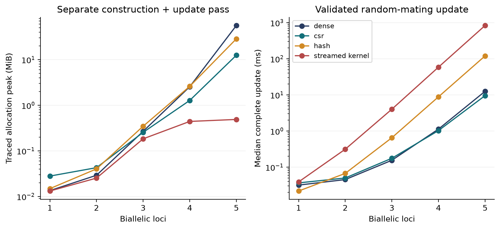
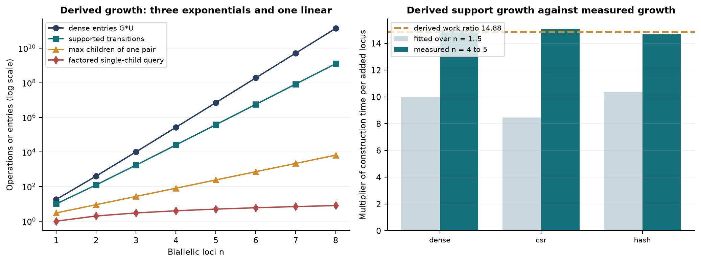
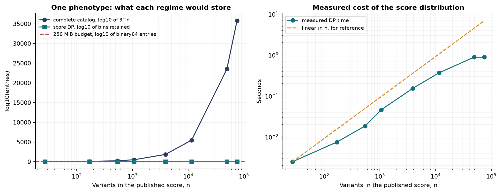

# Exact Bounds for Multilocus Mendelian Transmission

## And where factored polygenic representations stop scaling

Arshyia Mehran | ORCID 0009-0008-7960-2536 | {{DATE}}

Preprint, not peer reviewed. A companion long-form treatment, including the audit of an earlier model that motivated this work, is archived at doi:10.5281/zenodo.22401514. All code, tests, frozen data and retained results are at https://github.com/Arshyi/GeneticInheritanceModelling.

<!-- pagebreak -->

# Abstract

Inheritance across generations is routinely modelled by writing a Punnett square as a column of a transition matrix and raising that matrix to a power. Doing so requires the operator to be square, which for multi-allele or multilocus systems forces the modeller to discard parental pairs until the dimensions match.

We show the constraint is unnecessary and characterise exactly what replaces it. The parent-pair-to-offspring map is a rectangular kernel requiring neither inverse nor diagonalisation. For n independent biallelic diploid loci we prove by induction that the unphased catalog has G = 3^n entries, derive U = G(G+1)/2 unordered parental pairs, and show the kernel has exactly (15^n + 5^n)/2 supported transitions, generalising both to arbitrary allele counts. Density falls as (15/27)^n, so compression improves without bound while the nonzero count remains exponential.

We then give matching lower bounds. Any algorithm that materialises the complete kernel must write one value per supported transition and is therefore Omega(15^n); returning every child of a heterozygous pair is Omega(3^n) by output size alone. A factored query for one fully specified child must read every locus and is Omega(n); the implemented query runs in O(n) and is therefore asymptotically optimal. These bounds hold for any implementation, which is why no engineering removes the exponent.

Four implementations sharing one transmission semantics agree to 6.94e-17, and the derived growth exponent is confirmed against measured construction time to about 1.5 per cent at the top of the measured range. Finally we test the regimes on 88 published polygenic scores for one disease, spanning 27 to 7,082,943 variants. The complete kernel is unavailable at the smallest of them. The additive score dynamic programme handles all of them in about a second at a fixed bin budget, but real-valued effect weights must be discretised, and at a fixed budget the induced error exceeds the score's own standard deviation past roughly a thousand variants. Holding accuracy fixed instead forces the bin count to grow as n^(3/2), giving Theta(n^(5/2)) rather than the Theta(n^2) a fixed-bin analysis suggests; a controlled study returns a fitted exponent of 1.4987 against the derived 1.5.

No predictive accuracy is claimed for any trait. The contribution is a complete characterisation of what these representations cost, with the lower bounds that make those costs unavoidable.

**Keywords:** Mendelian inheritance; transition kernel; combinatorial growth; sparse representation; lower bounds; polygenic scores; computational complexity.

# 1. Introduction

A Punnett square answers a one-generation question. Asking it repeatedly across n generations is hopeless by hand, and the standard remedy is to treat each square as a column of a transition matrix M, write the population as a vector x of genotype proportions, and obtain generation n as M^n x. The move is old, effective, and taught widely.

It carries a cost that is rarely stated. Raising an operator to a power requires it to map a space to itself, so M must be square. But the natural object has parental *pairs* on one axis and offspring *genotypes* on the other, and those axes have different sizes as soon as a locus has more than two alleles or a model has more than one locus. The usual response is to retain only the most probable parental pairs until the matrix is square, discarding the rest.

**Related work.** The population-genetic foundation is Hardy's observation that genotype proportions are stable under random mating [hardy_1908], and the modelling of transmission across independent loci rests on standard meiotic recombination theory [{{LINKAGE_SOURCE}}] [alberts2002meiosis]. On the computational side, the representations compared here are standard: compressed sparse storage [scipy_csr_array], hash-based adjacency [sedgewickwayne_hash], and prefix structures such as tries and their compressed variants [sedgewickwayne_tries] [grossi2011compressedtries], which we consider and, for reasons given in Section 5.1, do not build. The factored query of Section 4 is an instance of probability factorisation in the sense of factor graphs and the sum-product algorithm [kschischang2001sumproduct], and of variable elimination [dechter1999bucket]; we make no claim to generalise either, and note that exactness on cyclic factor structures does not follow from the tree case. Reduced decision diagrams solve a related but distinct sharing problem [bryant1986bdd]. On the polygenic side, the scale at which modern trait models operate is set by studies such as the saturated map of common height-associated variation [yengo2022height], and the models we test against are drawn from the PGS Catalog [lambert2021pgscatalog].

What is, to our knowledge, absent from that literature is a matching pair of upper and lower bounds for the multilocus transmission kernel itself, and an accuracy-controlled cost for the additive score distribution. Those are the contributions here.

This paper asks what the constraint actually costs, and answers in three parts.

**Section 2** shows the constraint is unnecessary: the transmission map is rectangular and needs no inverse, and squareness was a consequence of wanting matrix powers rather than a property of inheritance. **Sections 3 and 4** characterise the resulting object exactly, deriving catalog size, pair count and supported-transition count in closed form, and then give matching *lower* bounds so the costs are attributes of the problem rather than of one implementation. **Sections 5 and 6** measure four implementations and then test the whole regime taxonomy against published polygenic scores that we did not write.

The last of these produces the paper's least comfortable result, and we state it here so it is not mistaken for a caveat: the factored representation that escapes the exponential does not thereby become size-free. At fixed accuracy it costs Theta(n^(5/2)), which still puts the largest published scores for a single disease out of reach.

# 2. The transmission kernel is rectangular

For a diploid genotype g = (u, v), define the gamete probability t_g(a) as one half the number of copies of allele a in g. For an unordered child genotype o = (a, b), transmission from parents g and h is t_g(a) t_h(a) when a = b, and t_g(a) t_h(b) + t_g(b) t_h(a) otherwise, the second expression summing the two parental routes to the same heterozygote. [{{LINKAGE_SOURCE}}] Under independent segregation the multilocus probability is the product over loci.

```equation
K[o, pair(i,j)] = P(child = o | parent1 = i, parent2 = j)
shape(K) = G x U,     sum over o of K[o, c] = 1
```

> **PROPOSITION 1.** K is a linear map from a distribution over parental pairs to a distribution over children. It requires neither an inverse nor a diagonalisation to perform that map, and need not be square.

The square form is therefore not wrong; it answers a different question. A square operator is legitimate for a lineage whose mates are drawn from a *fixed external* distribution q, via M_q[o, i] = sum over j of K[o, pair(i,j)] q_j, which maps individual genotypes to individual genotypes and preserves normalisation. What it cannot represent is a closed randomly mating population:

> **PROPOSITION 2.** Random mating is not linear in the genotype distribution. A population of only AA remains AA and one of only aa remains aa, but mixing them equally and allowing random mating gives (1/4, 1/2, 1/4), whereas averaging the two unmixed outcomes gives no heterozygotes. Hence F((x+y)/2) differs from (F(x)+F(y))/2 and no fixed matrix power represents the process.

The distinction is between the *state* the operator acts on and the operator itself. Both objects are useful; conflating them is what makes the square-matrix habit look mandatory.

# 3. Exact combinatorics

> **THEOREM 1 (catalog size).** For n independent biallelic diploid loci the number of distinct unphased multilocus genotypes is G(n) = 3^n.
>
> *Proof by induction on n.* For n = 1 the catalog is AA, Aa, aa, so G(1) = 3. Assume G(k) = 3^k. Every k-locus tuple extends at a new independent locus in exactly three ways; the extensions are distinct, and every (k+1)-locus tuple arises from exactly one k-locus prefix with exactly one appended state. The extension map is a bijection onto a set three times the size, so G(k+1) = 3G(k) = 3^(k+1). QED

> **THEOREM 2 (general catalog).** At a locus with a alleles there are a homozygotes and a(a-1)/2 heterozygotes, so a(a+1)/2 genotypes. Across n independent loci,
>
> ```equation
> G = product over l of [ a_l (a_l + 1) / 2 ]
> ```
>
> *Check.* ABO has a = 3, giving 6; a simplified Rh locus has a = 2, giving 3; combined, 18 — the catalog used in the classical treatment.

> **THEOREM 3 (parental pairs).** Choosing two genotypes from G with repetition and without order gives U = G + G(G-1)/2 = G(G+1)/2. For n biallelic loci this is 3^n(3^n+1)/2, asymptotically 9^n/2: **each added locus multiplies the parental-pair space by about nine.**

{{SCALING_TABLE}}

> **THEOREM 4 (supported transitions).** For one biallelic locus the numbers of possible children across the nine ordered parental pairs form rows (1,2,1), (2,3,2), (1,2,1), totalling 15; support products distribute over independent loci, so the ordered kernel has 15^n nonzeros. Pairing each supported transition with its parent-swapped counterpart, and noting a transition is fixed under the swap exactly when the parental genotypes are identical (single-locus counts 1, 3, 1, totalling 5), gives
>
> ```equation
> N_nonzero = (15^n + 5^n)/2,   N_dense = G U = (27^n + 9^n)/2,   density = (15^n + 5^n)/(27^n + 9^n)
> ```

> **THEOREM 5 (arbitrary alleles).** With H = a(a-1)/2, the sum of distinct transmissible allele counts over one-locus parental genotypes is a + 2H = a^2, so ordered pairs contribute a^4, less H duplicates from identical heterozygous parents: T(a) = a^4 - H. Equal-genotype pairs contribute D(a) = a + 3H. The unordered support total is one half of the product of T(a_l) plus the product of D(a_l).
>
> *Verified by exhaustive allele-copy enumeration:* 45 nonzeros for ABO, 615 for ABO x Rh.

Density falls as (15/27)^n. Compression therefore improves without bound, while the nonzero count still grows like 15^n. Sparsity is real and it is not a rescue.

# 4. Four regimes, and lower bounds

The difficulty of a query depends entirely on the size of its answer.

| Regime | Query answered | Time | Space |
|---|---|---|---|
| Complete kernel | Full parental-pair to child map, reusable | Theta(15^n) | Theta(15^n) |
| One full cross | All children of one specified pair | Theta(3^n) worst case | Theta(3^n) output |
| Factored query | Probability of one fully specified child | Theta(n) | Theta(n) |
| Score distribution | Distribution of an additive summary | Theta(n B) | Theta(B) |

Upper bounds describe an implementation. Lower bounds describe the problem.

> **THEOREM 6 (output-size lower bounds).**
>
> *(a)* Any algorithm materialising the complete kernel must write one value per supported transition. By Theorem 4 there are (15^n + 5^n)/2 of them, so any such algorithm is **Omega(15^n)** in time and space. The bound counts distinct mathematical values, not their encoding, so no representation evades it while remaining complete.
>
> *(b)* Take both parents heterozygous at every locus. Each locus admits three children with positive probability, so the child distribution has 3^n strictly positive entries and writing them is **Omega(3^n)**, for any representation.
>
> *(c)* The probability of a fully specified child depends on the parental genotypes at every locus; changing any one changes the answer. Any correct algorithm must read Omega(n) input. The implemented factored query runs in O(n), so it is **Theta(n) and asymptotically optimal**.
>
> *(d)* A score distribution over B bins must write B values, giving Omega(B); the dynamic programme achieves O(nB).

Parts (a) and (b) explain why the square-matrix difficulty was never an implementation defect. Parts (c) and (d) explain what the alternative actually buys: two of the four regimes are optimal or near-optimal, and both work by declining to produce an exponentially large object.

# 5. Implementation and measurement

## 5.1 One semantic kernel, four representations

Canonical unordered allele pairs per locus are encoded into a mixed-radix integer with validated bounds. Parent-exchange symmetry halves redundant work without deleting equal-genotype pairs; local Punnett outcomes aggregate repeated allele-copy paths and are cached in a bounded LRU table. Dense allocates all G x U binary64 entries. CSR stores positive transmissions with row indices and pointers. [{{HWE_SOURCE}}] Hash adjacency maps a parental pair to its children. Streamed generates local factor products on demand without storing the kernel. All four use one catalog order and one transmission rule, which is what makes the comparison meaningful.

**Numerical contract.** No probability threshold removes rare branches. Structural zeros are omitted in sparse forms; positive values are never pruned. Conditional queries expose a log-space interface, and the ordinary interface raises rather than silently returning zero when a mathematically positive result underflows.

**Verification.** An oracle enumerates maternal and paternal allele-copy choices independently of the kernel builder and sums exact rational weights. Exhaustive tests cover one-locus biallelic and triallelic systems, four-allele loci, two- and three-locus biallelic systems and ABO x Rh, checking parent-exchange symmetry, normalisation, support counts and exact Mendelian probabilities. {{TEST_STATUS}}

## 5.2 Measured cost

{{BENCH_TABLE}}

{{BENCH_RESULTS}}



Factored single-child queries, a smaller output, scale as Theorem 6(c) requires:

{{QUERY_TABLE}}

## 5.3 Derived growth against measured growth

{{COMPLEXITY_GROWTH_TABLE}}

{{COMPLEXITY_NOTE}}



> **RESULT 1.** From four to five loci the supported-transition count rises by 14.878. Measured construction time over the same step rose by 15.01 (dense), 15.09 (CSR) and 14.68 (hash): agreement to about 1.5 per cent. A single exponent fitted across all of n = 1..5 instead returns 8.5 to 10.4, because fixed per-call overhead dominates the smallest problems and flattens the slope. An asymptotic claim is entitled to the top of a measured range and not to the whole of it.

Per-model costs for the systems these representations are usually applied to:

{{COMPLEXITY_TRAIT_TABLE}}

At one biallelic locus density exceeds one half and compression is pointless; at five loci it is 0.0529 and compression saves an order of magnitude. The crossover is a property of the model, not a tuning choice.

# 6. The regimes tested on published polygenic scores

Everything above was tested on models we wrote. This section uses models we did not.

{{PGS_TRAIT_SUMMARY}}

Because these model the same phenotype, the comparison is internal: nothing changes between the smallest and largest except n.

**Assumptions, and one that matters.** Hardy-Weinberg dosage probabilities at every variant; effect weights treated as fixed and known; and **linkage equilibrium between variants**, which is false for scores built by LD-aware methods and means no reported spread is a population quantity. Where a score publishes no effect-allele frequency, one declared frequency is used and the run measures cost only. Scoring files are fetched at run time and not redistributed; digests and provenance are retained.

## 6.1 The complete kernel is unavailable at the smallest published model

{{PGS_KERNEL_TABLE}}

> **RESULT 2.** The smallest published coronary-artery-disease score uses 27 variants, giving a catalog of 3^27 = 7,625,597,484,987 genotypes and a dense payload of roughly 2.3e26 bytes. The largest uses 7,082,943 variants, for which 3^n has more than three million digits. The complete-kernel regime is unavailable for every published model of this disease, by counting, before any machine is involved.

## 6.2 The score distribution runs, and then stops meaning anything

{{PGS_LADDER_TABLE}}



Every score completes in about a second at a fixed budget of roughly forty thousand bins. That table alone reads as vindication. It is not.

> **RESULT 3.** The dynamic programme needs integer weights; real effect weights are continuous and must be rounded. Rounding each weight to the nearest multiple of delta displaces it by at most delta/2, and a dosage of at most 2 doubles that, so the total displacement is bounded by n*delta. Holding the bin count fixed holds delta fixed, so the error bound grows **linearly in n** while the score's own standard deviation grows only as sqrt(n).
>
> Measured on this ladder, the worst-case error crosses one standard deviation between n = 540 and n = 1,059, and reaches 1,443 standard deviations at n = 75,028. The runtimes are real; the distributions past about a thousand variants are worthless.

## 6.3 At fixed accuracy the exponent rises

> **THEOREM 7.** Requiring the worst-case error to stay within a fraction epsilon of the score standard deviation gives, with delta = 2 sum|w| / (B-1),
>
> ```equation
> B >= 1 + 2 n sum|w| / (epsilon * SD)
> ```
>
> For weights of comparable typical magnitude sum|w| grows like n and SD like sqrt(n), so **B = Theta(n^(3/2))** and the total work is **Theta(n B) = Theta(n^(5/2))**.
>
> A fixed-bin analysis instead returns Theta(n^2). The difference is precisely the cost of holding the answer's quality constant rather than its array length.

Published scores differ in method and weight scale, so an exponent fitted across them is confounded. A controlled study holds the weight distribution, seed and allele frequency fixed and moves only n:

{{PGS_SCALING_TABLE}}

{{PGS_SCALING_RESULT}}

> **RESULT 4.** {{PGS_EXTRAPOLATION}}

Three responses exist and none is implemented here: magnitude-aware discretisation, which would allocate resolution where weights are large rather than uniformly; a normal or saddlepoint approximation, which abandons exactness for a cost independent of n and is what production pipelines use; and sampling, which trades a discretisation bound for a Monte Carlo one. Choosing between them requires a stated question. For one individual's score no distribution is needed and the cost is Theta(n) by Theorem 6(c). For a population quantile an approximation with a calibration check is almost certainly correct. The exact distribution earns its exponent only when the tail itself is the object of study.

# 7. Discussion

The results divide cleanly into what is proved and what is measured, and the division matters because only the first transfers.

Proved: the catalog and pair counts (Theorems 1-3), the supported-transition count and its arbitrary-allele generalisation (Theorems 4-5), the output-size lower bounds (Theorem 6), and the accuracy-controlled exponent (Theorem 7). These are statements about the problem. No implementation, language or machine changes them.

Measured, on one machine and one workload: the four-way agreement to 6.94e-17, the payload and timing figures of Section 5.2, the confirmation of the derived exponent to about 1.5 per cent, and every number in Section 6. These are statements about this code, and they should be read as such.

The practical summary is that the architecture moves the wall twice and removes it never. Dropping the square-matrix constraint removes an artificial truncation and costs nothing in asymptotics. Moving from the complete kernel to a factored query removes the exponential for the questions that admit a small answer, and Theorem 6(c) shows that regime is optimal. Moving from genotype enumeration to a score distribution removes it again for additive summaries — and Theorem 7 shows what remains is a polynomial with an exponent high enough to matter at real sizes.

**Limitations.** Independent segregation is assumed throughout except where phase is introduced explicitly; two individuals with identical unphased genotypes can have different gamete distributions at linked loci, so the 3^n catalog does not determine transmission there. The catalog assumes autosomal diploidy and unordered allele pairs, and does not handle sex-linked dosage, imprinting, aneuploidy, copy-number variation or arbitrary pedigrees. Mutation is available as a supplied gamete transition but its rates are not estimated; admitting a positive rate makes every structural zero positive and removes the sparsity that motivates compression, which is a result in the companion treatment rather than here. Benchmarks are single-machine. Most consequentially, **no predictive accuracy is established for any trait**: no held-out phenotype data was used anywhere, and none of the polygenic scores in Section 6 is validated, criticised or applied to any individual.

# 8. Availability and disclosure

Source code, tests, frozen datasets with digests, raw benchmark output, figures and the build that produces this document are at https://github.com/Arshyi/GeneticInheritanceModelling. Every number here is bound at build time to a retained machine-readable result; none is typed by hand. The companion long-form treatment is archived at doi:10.5281/zenodo.22401514.

Aggregate allele and genotype counts for rs334 and rs12913832 come from the Ensembl REST API for the 1000 Genomes phase 3 panel and are stored with SHA-256 digests. [{{1000G_SOURCE}}] Polygenic scores are fetched from the PGS Catalog at run time and not redistributed. [lambert2021pgscatalog] [pgs_catalog_cad_20260906] No individual-level data is used, held or distributed. No human subjects were involved and no ethical approval was required.

Computation, figure generation and manuscript preparation were assisted by AI tools. Scientific authorship, interpretation and responsibility for every claim are the author's. Code is MIT licensed; the written work is CC BY 4.0.

# References

{{BIBLIOGRAPHY}}
